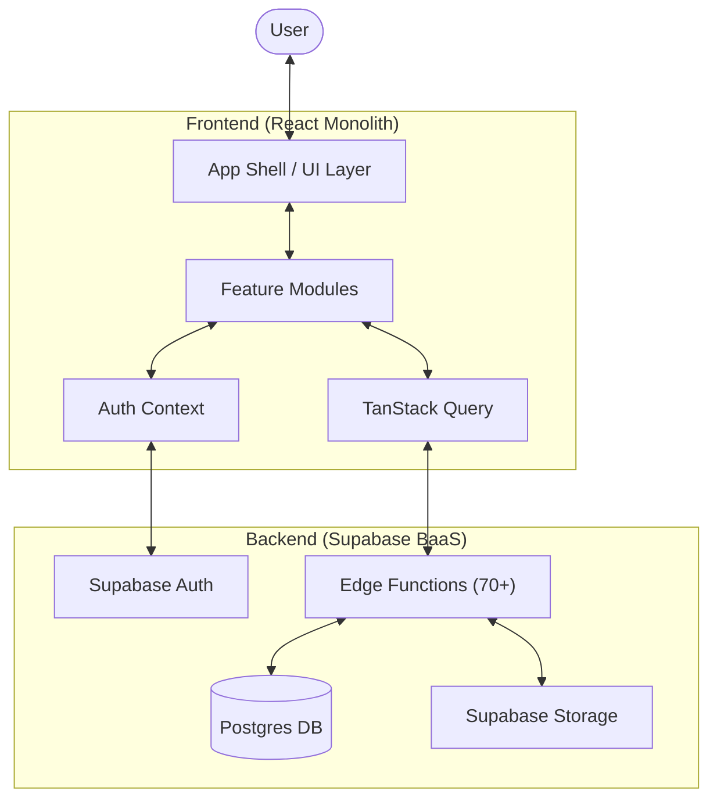

# 🏗️ StuddyHub Architecture Documentation

## Table of Contents

- [System Overview](#system-overview)
- [Technology Stack](#technology-stack)
- [Application Architecture](#application-architecture)
- [Database Schema](#database-schema)
- [Component Structure](#component-structure)
- [State Management](#state-management)
- [API & Services](#api--services)
- [Security Architecture](#security-architecture)
- [Performance Optimization](#performance-optimization)
- [Deployment Architecture](#deployment-architecture)

---

## System Overview

StuddyHub is built on a modern, scalable architecture that effectively combines a **Modular Monolith** on the frontend with a **Serverless (Edge Function) Backend**.

### High-Level Architecture



### Key Architectural Patterns

- **Modular Monolith (Frontend)**: The UI is a single deployable unit but organized into strictly decoupled feature modules (Social, Notes, AI Chat, etc.).
- **Serverless Edge Logic (Backend)**: Instead of a monolithic API server, logic is distributed across 70+ standalone Supabase Edge Functions.
- **App Shell Pattern**: A central `Index.tsx` acts as a host for dynamic feature modules, providing smooth client-side transitions.
- **Offline-First Ready**: Built-in support for offline tracking and background synchronization.

---

## Technology Stack

### Frontend Technologies

| Technology     | Version  | Purpose                 |
| -------------- | -------- | ----------------------- |
| React          | 18.3.1   | UI framework            |
| TypeScript     | 5.5.3    | Type safety             |
| Vite           | 7.2.7    | Build tool & dev server |
| React Router   | 6.26.2   | Client-side routing     |
| TanStack Query | 5.56.2   | Server state management |
| TailwindCSS    | 3.4.18   | Utility-first styling   |
| Shadcn/ui      | Latest   | UI component library    |
| TipTap         | 2.27.1   | Rich text editor        |
| Framer Motion  | 12.23.12 | Animation library       |
| Lucide React   | 0.462.0  | Icon library            |
| Zod            | 3.23.8   | Schema validation       |

### Backend Technologies

| Technology            | Purpose                 |
| --------------------- | ----------------------- |
| Supabase              | Backend-as-a-Service    |
| PostgreSQL 15         | Primary database        |
| PostgREST             | Auto-generated REST API |
| Supabase Auth         | Authentication service  |
| Supabase Storage      | File storage            |
| Supabase Realtime     | WebSocket connections   |
| Edge Functions (Deno) | Serverless functions    |

### AI & ML

| Service             | Purpose                   |
| ------------------- | ------------------------- |
| Google Gemini Pro   | Text generation, analysis |
| Google Gemini Flash | Fast responses            |
| Custom prompts      | Context-aware assistance  |

---

## Application Architecture

### Frontend Layer (Modular Monolith)

The frontend is organized into logical feature domains. This prevents cross-feature leakage and allows for easier maintenance.

```
src/
├── main.tsx                 # Application entry point
├── App.tsx                  # Root component with routing
│
├── pages/                   # Route pages (13 pages)
│   ├── Index.tsx           # Main dashboard (authenticated)
│   ├── LandingPage.tsx     # Marketing homepage
│   ├── Auth.tsx            # Login/signup
│   └── ...
│
├── components/             # React components
│   ├── ui/                # Base UI components (40+)
│   │   ├── button.tsx
│   │   ├── input.tsx
│   │   ├── dialog.tsx
│   │   └── ...
│   │
│   ├── layout/            # Layout components
│   │   ├── Sidebar.tsx
│   │   ├── Header.tsx
│   │   └── Footer.tsx
│   │
│   ├── notes/             # Note-taking feature
│   │   ├── NoteEditor.tsx
│   │   ├── NoteList.tsx
│   │   └── NoteViewer.tsx
│   │
│   ├── aiChat/            # AI chat interface
│   │   ├── ChatInterface.tsx
│   │   ├── MessageList.tsx
│   │   └── ChatInput.tsx
│   │
│   ├── documents/         # Document management
│   ├── classRecordings/   # Recording features
│   ├── quizzes/           # Quiz system
│   ├── social/            # Social features
│   ├── subscription/      # Subscription UI
│   └── admin/             # Admin panel
│
├── contexts/              # React contexts
│   ├── AppContext.tsx     # Global app state
│   └── appReducer.ts      # State reducer logic
│
├── hooks/                 # Custom React hooks (20+)
│   ├── useAuth.tsx        # Authentication
│   ├── useAppData.tsx     # Data fetching
│   ├── useSubscription.ts # Subscription logic
│   └── ...
│
├── services/              # Business logic layer
│   ├── aiServices.ts      # AI integration
│   ├── messageServices.ts # Message handling
│   └── ...
│
├── utils/                 # Utility functions
│   ├── tokenCounter.ts    # AI token tracking
│   ├── subscriptionChecks.ts
│   └── ...
│
├── types/                 # TypeScript definitions
│   ├── Note.ts
│   ├── Document.ts
│   ├── Subscription.ts
│   └── ...
│
└── integrations/          # Third-party integrations
    └── supabase/
        ├── client.ts      # Supabase client
        └── types.ts       # Supabase types
```

### Design Patterns

#### 1. Component Composition

```typescript
// Base UI components are composed into feature components
<Dialog>
  <DialogTrigger asChild>
    <Button>Open Note</Button>
  </DialogTrigger>
  <DialogContent>
    <NoteEditor note={note} />
  </DialogContent>
</Dialog>
```

#### 2. Custom Hooks Pattern

```typescript
// Separation of concerns - logic in hooks
function NoteList() {
  const { notes, loading } = useAppData();
  const { canCreateNote } = useFeatureAccess();

  // Component focuses on UI
  return <div>...</div>;
}
```

#### 3. Service Layer Pattern

```typescript
// Business logic separated from components
export const aiServices = {
  sendMessage: async (message: string) => { ... },
  analyzeDocument: async (doc: Document) => { ... },
  generateQuiz: async (noteId: string) => { ... }
};
```

#### 4. Context + Reducer Pattern

```typescript
// Global state management
const [state, dispatch] = useReducer(appReducer, initialState);

// Actions
dispatch({ type: "ADD_NOTE", payload: note });
dispatch({ type: "UPDATE_SUBSCRIPTION", payload: subscription });
```

---

## Database Schema

### Core Tables

#### `profiles`

User profile information

```sql
CREATE TABLE profiles (
  id UUID PRIMARY KEY REFERENCES auth.users(id),
  email TEXT NOT NULL,
  full_name TEXT,
  avatar_url TEXT,
  learning_style TEXT CHECK (learning_style IN ('visual', 'auditory', 'kinesthetic', 'reading')),
  learning_preferences JSONB DEFAULT '{}',
  created_at TIMESTAMPTZ DEFAULT NOW(),
  updated_at TIMESTAMPTZ DEFAULT NOW()
);

-- Indexes
CREATE INDEX idx_profiles_email ON profiles(email);
```

#### `subscriptions`

User subscription data

```sql
CREATE TABLE subscriptions (
  id UUID PRIMARY KEY DEFAULT uuid_generate_v4(),
  user_id UUID REFERENCES profiles(id) ON DELETE CASCADE,
  tier TEXT NOT NULL CHECK (tier IN ('visitor', 'scholar', 'genius')),
  status TEXT NOT NULL CHECK (status IN ('active', 'cancelled', 'expired')),
  current_period_start TIMESTAMPTZ NOT NULL,
  current_period_end TIMESTAMPTZ NOT NULL,
  payment_id TEXT,
  created_at TIMESTAMPTZ DEFAULT NOW(),
  updated_at TIMESTAMPTZ DEFAULT NOW(),

  UNIQUE(user_id)
);

-- Indexes
CREATE INDEX idx_subscriptions_user ON subscriptions(user_id);
CREATE INDEX idx_subscriptions_status ON subscriptions(status);
```

#### `notes`

Note storage

```sql
CREATE TABLE notes (
  id UUID PRIMARY KEY DEFAULT uuid_generate_v4(),
  user_id UUID REFERENCES profiles(id) ON DELETE CASCADE,
  folder_id UUID REFERENCES folders(id) ON DELETE SET NULL,
  title TEXT NOT NULL,
  content TEXT NOT NULL,
  category TEXT,
  tags TEXT[],
  ai_summary TEXT,
  created_at TIMESTAMPTZ DEFAULT NOW(),
  updated_at TIMESTAMPTZ DEFAULT NOW()
);

-- Indexes
CREATE INDEX idx_notes_user ON notes(user_id);
CREATE INDEX idx_notes_folder ON notes(folder_id);
CREATE INDEX idx_notes_created ON notes(created_at DESC);
CREATE INDEX idx_notes_tags ON notes USING GIN(tags);

-- Full-text search
CREATE INDEX idx_notes_content ON notes USING GIN(to_tsvector('english', content));
```

#### `documents`

Document metadata

```sql
CREATE TABLE documents (
  id UUID PRIMARY KEY DEFAULT uuid_generate_v4(),
  user_id UUID REFERENCES profiles(id) ON DELETE CASCADE,
  folder_id UUID REFERENCES folders(id) ON DELETE SET NULL,
  title TEXT NOT NULL,
  file_path TEXT NOT NULL,
  file_type TEXT NOT NULL,
  file_size INTEGER NOT NULL,
  content TEXT,
  ai_summary TEXT,
  metadata JSONB DEFAULT '{}',
  created_at TIMESTAMPTZ DEFAULT NOW(),
  updated_at TIMESTAMPTZ DEFAULT NOW()
);

-- Indexes
CREATE INDEX idx_documents_user ON documents(user_id);
CREATE INDEX idx_documents_folder ON documents(folder_id);
CREATE INDEX idx_documents_type ON documents(file_type);
```

#### `recordings`

Audio recordings

```sql
CREATE TABLE recordings (
  id UUID PRIMARY KEY DEFAULT uuid_generate_v4(),
  user_id UUID REFERENCES profiles(id) ON DELETE CASCADE,
  title TEXT NOT NULL,
  file_path TEXT NOT NULL,
  duration INTEGER NOT NULL, -- in seconds
  transcription TEXT,
  ai_summary TEXT,
  metadata JSONB DEFAULT '{}',
  created_at TIMESTAMPTZ DEFAULT NOW(),
  updated_at TIMESTAMPTZ DEFAULT NOW()
);

-- Indexes
CREATE INDEX idx_recordings_user ON recordings(user_id);
CREATE INDEX idx_recordings_created ON recordings(created_at DESC);
```

#### `folders`

Folder structure

```sql
CREATE TABLE folders (
  id UUID PRIMARY KEY DEFAULT uuid_generate_v4(),
  user_id UUID REFERENCES profiles(id) ON DELETE CASCADE,
  name TEXT NOT NULL,
  parent_id UUID REFERENCES folders(id) ON DELETE CASCADE,
  created_at TIMESTAMPTZ DEFAULT NOW(),
  updated_at TIMESTAMPTZ DEFAULT NOW(),

  -- Prevent circular references
  CHECK (id != parent_id)
);

-- Indexes
CREATE INDEX idx_folders_user ON folders(user_id);
CREATE INDEX idx_folders_parent ON folders(parent_id);
```

#### `ai_messages`

AI chat history

```sql
CREATE TABLE ai_messages (
  id UUID PRIMARY KEY DEFAULT uuid_generate_v4(),
  user_id UUID REFERENCES profiles(id) ON DELETE CASCADE,
  role TEXT NOT NULL CHECK (role IN ('user', 'assistant', 'system')),
  content TEXT NOT NULL,
  tokens_used INTEGER DEFAULT 0,
  context_ids UUID[], -- Related notes/documents
  created_at TIMESTAMPTZ DEFAULT NOW()
);

-- Indexes
CREATE INDEX idx_messages_user ON ai_messages(user_id);
CREATE INDEX idx_messages_created ON ai_messages(created_at DESC);
```

#### `quizzes`

Quiz data

```sql
CREATE TABLE quizzes (
  id UUID PRIMARY KEY DEFAULT uuid_generate_v4(),
  user_id UUID REFERENCES profiles(id) ON DELETE CASCADE,
  note_id UUID REFERENCES notes(id) ON DELETE CASCADE,
  title TEXT NOT NULL,
  questions JSONB NOT NULL,
  difficulty TEXT CHECK (difficulty IN ('beginner', 'intermediate', 'advanced')),
  created_at TIMESTAMPTZ DEFAULT NOW()
);

-- Indexes
CREATE INDEX idx_quizzes_user ON quizzes(user_id);
CREATE INDEX idx_quizzes_note ON quizzes(note_id);
```

#### `quiz_attempts`

Quiz attempt tracking

```sql
CREATE TABLE quiz_attempts (
  id UUID PRIMARY KEY DEFAULT uuid_generate_v4(),
  user_id UUID REFERENCES profiles(id) ON DELETE CASCADE,
  quiz_id UUID REFERENCES quizzes(id) ON DELETE CASCADE,
  score INTEGER NOT NULL,
  answers JSONB NOT NULL,
  completed_at TIMESTAMPTZ DEFAULT NOW()
);

-- Indexes
CREATE INDEX idx_attempts_user ON quiz_attempts(user_id);
CREATE INDEX idx_attempts_quiz ON quiz_attempts(quiz_id);
```

#### `posts` (Social)

User posts

```sql
CREATE TABLE posts (
  id UUID PRIMARY KEY DEFAULT uuid_generate_v4(),
  user_id UUID REFERENCES profiles(id) ON DELETE CASCADE,
  content TEXT NOT NULL,
  media_url TEXT,
  likes_count INTEGER DEFAULT 0,
  comments_count INTEGER DEFAULT 0,
  created_at TIMESTAMPTZ DEFAULT NOW(),
  updated_at TIMESTAMPTZ DEFAULT NOW()
);

-- Indexes
CREATE INDEX idx_posts_user ON posts(user_id);
CREATE INDEX idx_posts_created ON posts(created_at DESC);
```

#### `follows`

User following relationships

```sql
CREATE TABLE follows (
  id UUID PRIMARY KEY DEFAULT uuid_generate_v4(),
  follower_id UUID REFERENCES profiles(id) ON DELETE CASCADE,
  following_id UUID REFERENCES profiles(id) ON DELETE CASCADE,
  created_at TIMESTAMPTZ DEFAULT NOW(),

  UNIQUE(follower_id, following_id),
  CHECK (follower_id != following_id)
);

-- Indexes
CREATE INDEX idx_follows_follower ON follows(follower_id);
CREATE INDEX idx_follows_following ON follows(following_id);
```

#### `usage_tracking`

Daily usage limits

```sql
CREATE TABLE usage_tracking (
  id UUID PRIMARY KEY DEFAULT uuid_generate_v4(),
  user_id UUID REFERENCES profiles(id) ON DELETE CASCADE,
  date DATE NOT NULL DEFAULT CURRENT_DATE,
  ai_messages_count INTEGER DEFAULT 0,
  quizzes_taken INTEGER DEFAULT 0,
  recordings_created INTEGER DEFAULT 0,

  UNIQUE(user_id, date)
);

-- Indexes
CREATE INDEX idx_usage_user_date ON usage_tracking(user_id, date DESC);
```

### Row Level Security (RLS)

All tables have RLS enabled:

```sql
-- Example: Notes table
ALTER TABLE notes ENABLE ROW LEVEL SECURITY;

-- Users can only see their own notes
CREATE POLICY "Users can view own notes"
  ON notes FOR SELECT
  USING (auth.uid() = user_id);

-- Users can only insert their own notes
CREATE POLICY "Users can insert own notes"
  ON notes FOR INSERT
  WITH CHECK (auth.uid() = user_id);

-- Users can only update their own notes
CREATE POLICY "Users can update own notes"
  ON notes FOR UPDATE
  USING (auth.uid() = user_id);

-- Users can only delete their own notes
CREATE POLICY "Users can delete own notes"
  ON notes FOR DELETE
  USING (auth.uid() = user_id);
```

### Database Functions

#### Check subscription limits

```sql
CREATE OR REPLACE FUNCTION check_note_limit(p_user_id UUID)
RETURNS BOOLEAN AS $$
DECLARE
  v_tier TEXT;
  v_count INTEGER;
BEGIN
  SELECT tier INTO v_tier
  FROM subscriptions
  WHERE user_id = p_user_id AND status = 'active';

  IF v_tier = 'visitor' THEN
    SELECT COUNT(*) INTO v_count FROM notes WHERE user_id = p_user_id;
    RETURN v_count < 50;
  ELSE
    RETURN TRUE; -- No limit for paid tiers
  END IF;
END;
$$ LANGUAGE plpgsql SECURITY DEFINER;
```

---

## Component Structure

### Component Hierarchy

```
App.tsx
├── HelmetProvider (SEO)
├── QueryClientProvider (Data fetching)
├── AuthProvider (Authentication)
├── AdminAuthProvider (Admin auth)
└── AppProvider (Global state)
    └── BrowserRouter
        ├── Routes
        │   ├── LandingPage (/)
        │   ├── Auth (/auth)
        │   ├── Index (/dashboard) [Protected]
        │   │   ├── Sidebar
        │   │   ├── Header
        │   │   └── Content Area
        │   │       ├── Dashboard
        │   │       ├── Notes
        │   │       ├── Documents
        │   │       ├── AI Chat
        │   │       ├── Recordings
        │   │       ├── Quizzes
        │   │       ├── Schedule
        │   │       └── Social
        │   ├── AdminLayout (/admin) [Protected + Admin]
        │   │   ├── AdminDashboard
        │   │   ├── UserManagement
        │   │   └── ...
        │   └── ...
        ├── Toaster (Toast notifications)
        ├── Sonner (Additional toasts)
        └── Analytics (Vercel Analytics)
```

### Key Components

#### Protected Route Component

```typescript
// src/components/ProtectedRoute.tsx
export function ProtectedRoute({ children }: { children: React.ReactNode }) {
  const { user, loading } = useAuth();

  if (loading) return <LoadingSpinner />;
  if (!user) return <Navigate to="/auth" />;

  return <>{children}</>;
}
```

#### Feature Access Guard

```typescript
// Checks subscription limits before allowing actions
const { canCreateNote } = useFeatureAccess();

if (!canCreateNote) {
  toast.error("Note limit reached. Please upgrade.");
  return;
}
```

---

## State Management

### Global UI State (AppContext)

The `AppContext` is used for **Global UI State** (theming, sidebar toggle, notification counts) and certain aggregated data that needs to be accessible everywhere.

```typescript
// src/contexts/AppContext.tsx
interface AppState {
  user: User | null;
  subscription: Subscription | null;
  notes: Note[];
  documents: Document[];
  recordings: Recording[];
  folders: Folder[];
  loading: boolean;
  onPostCreated?: () => void; // Event handlers
}
```

### Server State Strategy (TanStack Query)

While `AppContext` holds some data, **TanStack Query** is the primary source of truth for all server-side data (notes, posts, documents). This provides:

- **Automatic Caching**: Prevents redundant network requests.
- **Optimistic Updates**: Immediate UI feedback for actions like liking a post.
- **Auto-Refetching**: Keeps data fresh across different views.

### State Actions

```typescript
// src/contexts/appReducer.ts
type AppAction =
  | { type: "SET_USER"; payload: User }
  | { type: "SET_SUBSCRIPTION"; payload: Subscription }
  | { type: "ADD_NOTE"; payload: Note }
  | { type: "UPDATE_NOTE"; payload: Note }
  | { type: "DELETE_NOTE"; payload: string }
  | { type: "SET_NOTES"; payload: Note[] }
  | { type: "ADD_DOCUMENT"; payload: Document }
  | { type: "SET_LOADING"; payload: boolean };
// ... more actions
```

### Server State (TanStack Query)

```typescript
// Data fetching with caching
const { data: notes, isLoading } = useQuery({
  queryKey: ["notes", userId],
  queryFn: () => fetchNotes(userId),
  staleTime: 5 * 60 * 1000, // 5 minutes
});

// Mutations
const createNoteMutation = useMutation({
  mutationFn: createNote,
  onSuccess: () => {
    queryClient.invalidateQueries(["notes"]);
  },
});
```

---

## API & Services

### Serverless Logic (70+ Supabase Edge Functions)

The backend logic is decentralized into **70+ standalone TypeScript functions** running on the Deno runtime. This architecture enables:

- **Independent Scaling**: Each feature's logic scales separately.
- **Compute-Intensive Tasks**: Logic like AI quiz generation and document parsing is offloaded from the client.
- **Secure Integration**: Sensitive operations (e.g., Paystack payments, Gemini AI keys) are handled in a protected environment.

#### AI Chat Function

```typescript
// supabase/functions/ai-chat/index.ts
Deno.serve(async (req) => {
  const { message, context, userId } = await req.json();

  // Check rate limits
  const canSend = await checkMessageLimit(userId);
  if (!canSend) {
    return new Response(JSON.stringify({ error: "Daily limit reached" }), {
      status: 429,
    });
  }

  // Generate AI response
  const response = await generateAIResponse(message, context);

  // Track usage
  await trackMessageUsage(userId);

  return new Response(JSON.stringify({ response }), {
    headers: { "Content-Type": "application/json" },
  });
});
```

#### Document Analysis Function

```typescript
// supabase/functions/analyze-document/index.ts
Deno.serve(async (req) => {
  const { documentId, userId } = await req.json();

  // Fetch document
  const document = await getDocument(documentId);

  // Extract content based on file type
  const content = await extractContent(document);

  // Analyze with AI
  const analysis = await analyzeWithGemini(content);

  // Store results
  await updateDocument(documentId, {
    content,
    ai_summary: analysis.summary,
  });

  return new Response(JSON.stringify({ analysis }));
});
```

### Frontend Service Layer

```typescript
// src/services/aiServices.ts
export const aiServices = {
  async sendMessage(message: string, contextIds: string[] = []) {
    const { data, error } = await supabase.functions.invoke("ai-chat", {
      body: { message, contextIds },
    });

    if (error) throw error;
    return data;
  },

  async analyzeDocument(documentId: string) {
    const { data, error } = await supabase.functions.invoke(
      "analyze-document",
      { body: { documentId } },
    );

    if (error) throw error;
    return data;
  },
};
```

---

## Security Architecture

### Authentication Flow

```
1. User signs up/login
   ↓
2. Supabase Auth creates session
   ↓
3. JWT token stored in localStorage
   ↓
4. Token included in all API requests
   ↓
5. Supabase validates token
   ↓
6. RLS policies enforce data access
```

### Authorization Layers

1. **Frontend Guards** - Prevent UI access
2. **RLS Policies** - Database-level security
3. **Edge Function Auth** - API endpoint protection
4. **Subscription Checks** - Feature gating

### Security Best Practices

- ✅ All passwords hashed with bcrypt
- ✅ JWT tokens with expiration
- ✅ HTTPS only in production
- ✅ CORS configured for specific origins
- ✅ Input validation with Zod
- ✅ HTML sanitization with DOMPurify
- ✅ SQL injection prevention (parameterized queries)
- ✅ Rate limiting on sensitive endpoints

---

## Performance Optimization

### Frontend Optimization

#### Code Splitting

```typescript
// Lazy load admin components
const AdminDashboard = lazy(() => import("./components/admin/AdminDashboard"));
```

#### Memoization

```typescript
const expensiveCalculation = useMemo(() => {
  return calculateStats(data);
}, [data]);

const handleClick = useCallback(() => {
  // Handler logic
}, [dependencies]);
```

#### Virtual Scrolling

```typescript
// For large lists
import { FixedSizeList } from 'react-window';

<FixedSizeList
  height={600}
  itemCount={notes.length}
  itemSize={100}
>
  {NoteItem}
</FixedSizeList>
```

### Database Optimization

- Indexes on frequently queried columns
- Connection pooling
- Query result caching
- Materialized views for analytics

### Caching Strategy

```typescript
// TanStack Query caching
queryClient.setDefaultOptions({
  queries: {
    staleTime: 5 * 60 * 1000, // 5 minutes
    cacheTime: 10 * 60 * 1000, // 10 minutes
    refetchOnWindowFocus: false,
  },
});
```

---

## Deployment Architecture

### Production Stack

```
User Request
    ↓
Vercel Edge Network (CDN)
    ↓
React SPA (Static assets cached)
    ↓
Supabase API (Frankfurt/US region)
    ↓
PostgreSQL Database (Replicated)
```

### Environment Configuration

```env
# Development
VITE_SUPABASE_URL=https://xxx.supabase.co
VITE_SUPABASE_ANON_KEY=xxx
VITE_GEMINI_API_KEY=xxx

# Production
VITE_SUPABASE_URL=https://prod.supabase.co
VITE_SUPABASE_ANON_KEY=prod_key
VITE_GEMINI_API_KEY=prod_key
```

### CI/CD Pipeline

```yaml
# .github/workflows/deploy.yml
name: Deploy
on:
  push:
    branches: [main]

jobs:
  deploy:
    runs-on: ubuntu-latest
    steps:
      - uses: actions/checkout@v2
      - run: npm install
      - run: npm run build
      - run: npx supabase db push
      - run: npx supabase functions deploy
      - uses: vercel/deploy@v1
```

### Monitoring

- **Vercel Analytics** - Performance monitoring
- **Supabase Dashboard** - Database metrics
- **Error Tracking** - Production error logging
- **Usage Analytics** - Feature usage tracking

---

## Scalability Considerations

### Current Capacity

- **Database**: Up to 500GB, 100 connections
- **Storage**: Unlimited with Supabase
- **Edge Functions**: Auto-scaling
- **CDN**: Global distribution

### Horizontal Scaling

- **Database**: Read replicas for heavy queries
- **Caching**: Redis for session/query caching
- **CDN**: Vercel Edge for global distribution
- **Functions**: Automatically scale with load

### Future Improvements

- [ ] Implement read replicas
- [ ] Add Redis caching layer
- [ ] Database sharding for multi-tenancy
- [ ] Microservices for heavy AI processing
- [ ] Message queue for background jobs

---

## Conclusion

StuddyHub's architecture is designed for:

- ✅ **Scalability** - Can handle growing user base
- ✅ **Performance** - Fast load times and responses
- ✅ **Security** - Multiple layers of protection
- ✅ **Maintainability** - Clean, modular code
- ✅ **Developer Experience** - Modern tooling and patterns

For more details on specific components, see:

- [API Reference](API_REFERENCE.md)
- [Features Documentation](FEATURES.md)
- [Deployment Guide](DEPLOYMENT.md)
