# Educational Contextualization Architecture

> **Technical Design Document — StuddyHub**
> Version 1.0 | February 21, 2026
> Status: **Proposal / RFC**

---

## Table of Contents

1. [Executive Summary](#1-executive-summary)
2. [Current State Analysis](#2-current-state-analysis)
3. [Database & Data Modeling](#3-database--data-modeling)
4. [Smart Onboarding](#4-smart-onboarding)
5. [Dynamic Dashboard & Conditional Rendering](#5-dynamic-dashboard--conditional-rendering)
6. [Global State Management](#6-global-state-management)
7. [AI & Edge Function Integration](#7-ai--edge-function-integration)
8. [Component Architecture Diagram](#8-component-architecture-diagram)
9. [Migration Strategy](#9-migration-strategy)
10. [Files Requiring Modification](#10-files-requiring-modification)
11. [MVP Scope: Ghana](#11-mvp-scope-ghana)
12. [Future Extensibility](#12-future-extensibility)
13. [Open Questions & Risks](#13-open-questions--risks)

---

## 1. Executive Summary

### Problem

StuddyHub currently treats every user identically. The `profiles` table stores a free-text `school` field and a `personal_context` blob, but nothing structured about the user's **country, education level, curriculum, or examination goals**. This makes it impossible to provide curriculum-aligned study content, examination countdowns, or localized terminology.

### Proposed Solution

Introduce a **data-driven Educational Context** system that:

1. Models global educational frameworks in a normalized, extensible relational schema.
2. Captures user context during onboarding via a cascading, dynamically-loaded wizard.
3. Makes that context available globally via `AppContext` so any component can adapt.
4. Drives dashboard widget rendering through a **Widget Registry** pattern (zero hardcoded `if/else`).
5. Feeds AI services with structured context for curriculum-aware responses.

### Design Principles

| Principle | Implication |
|---|---|
| **Global-first** | No hardcoded country logic. All educational structures are database rows. |
| **Data-driven UI** | Widgets, labels, and layouts are selected by querying against the user's context — not by branching on country codes in React components. |
| **Progressive disclosure** | Onboarding adds context gradually; the app remains fully usable even when context is incomplete. |
| **Backward compatible** | Existing users without educational context see the current experience unchanged. |

---

## 2. Current State Analysis

### Existing Profile Schema (`profiles` table)

| Column | Type | Notes |
|---|---|---|
| `id` | `uuid` PK | Matches `auth.users.id` |
| `full_name` | `text` | |
| `email` | `text` | |
| `school` | `text` | Free-text, e.g. "KNUST" |
| `learning_style` | `text` | "visual" / "auditory" / etc. |
| `learning_preferences` | `jsonb` | Unstructured blob |
| `personal_context` | `text` | Free-text injected into AI prompts |
| `quiz_preferences` | `jsonb` | |
| `username` | `text` | |
| `avatar_url` | `text` | |
| `is_public` | `boolean` | |
| `points_balance` | `integer` | |
| `bonus_ai_credits` | `integer` | |
| `referral_code` / `referral_count` | `text` / `integer` | |

**Key gaps:**
- No `country` or `country_code`.
- No structured `education_level`, `grade`/`year`, or `institution_type`.
- No link to a curriculum or examination.
- The `school` field is ambiguous (is it an institution name? a level?).
- `personal_context` is unstructured text — useful for AI prompts, but not queryable.

### Existing Onboarding Steps (OnboardingWizard.tsx — 826 lines)

1. **Welcome** — feature showcase
2. **Profile** — `full_name`, `school`, avatar
3. **Learning** — style, difficulty, explanation style
4. **Personalization** — quick-pick tags + free-text `personal_context`
5. **Permissions** — push / mic / camera

The wizard does **not** ask about country, educational level, or examinations.

### Existing Dashboard (Dashboard.tsx — 555 lines)

Three tabs (Overview, Analytics, Activity) with hardcoded widgets driven by `useDashboardStats`. No concept of conditional widgets based on user context.

### Existing State Management

- `AppState` (in `appReducer.ts`) holds chat/UI state but no educational context.
- `useAppData` fetches `userProfile` from `profiles` and caches in memory + IndexedDB.
- `UserProfile` TypeScript interface mirrors the DB columns — no educational fields.

---

## 3. Database & Data Modeling

### 3.1 Entity-Relationship Diagram

```mermaid
erDiagram
    countries {
        uuid id PK
        text code "ISO 3166-1 alpha-2"
        text name
        text flag_emoji
        text[] official_languages
        jsonb metadata
        boolean is_active
        integer sort_order
        timestamptz created_at
    }

    education_levels {
        uuid id PK
        uuid country_id FK
        text code "e.g. gh_jhs, gh_shs, gh_uni"
        text name "e.g. Junior High School"
        text short_name "e.g. JHS"
        text category "pre_primary | primary | lower_secondary | upper_secondary | tertiary | postgraduate"
        integer sort_order
        integer typical_start_age
        integer typical_duration_years
        jsonb metadata
        boolean is_active
        timestamptz created_at
    }

    curricula {
        uuid id PK
        uuid country_id FK
        uuid education_level_id FK
        text code "e.g. gh_bece, gh_wassce, uk_gcse"
        text name "e.g. WASSCE (SSSCE)"
        text description
        text governing_body "e.g. WAEC, College Board"
        jsonb metadata
        boolean is_active
        timestamptz created_at
    }

    examinations {
        uuid id PK
        uuid curriculum_id FK
        text code "e.g. wassce_2026, sat_spring_2026"
        text name "e.g. WASSCE 2026"
        date typical_date "approximate exam date"
        text recurrence "annual | biannual | quarterly | on_demand"
        jsonb metadata
        boolean is_active
        timestamptz created_at
    }

    subjects {
        uuid id PK
        uuid curriculum_id FK
        text code "e.g. math_core, eng_lang"
        text name "e.g. Core Mathematics"
        text category "core | elective"
        integer sort_order
        jsonb metadata
        boolean is_active
        timestamptz created_at
    }

    user_education_profiles {
        uuid id PK
        uuid user_id FK "→ profiles.id (UNIQUE)"
        uuid country_id FK "→ countries.id"
        uuid education_level_id FK "→ education_levels.id"
        uuid curriculum_id FK "→ curricula.id (nullable)"
        uuid target_examination_id FK "→ examinations.id (nullable)"
        text institution_name "e.g. Achimota School"
        text year_or_grade "e.g. Year 2, Form 3, Grade 11"
        date expected_completion
        jsonb goals "structured goals array"
        jsonb metadata "extensible JSON"
        timestamptz created_at
        timestamptz updated_at
    }

    user_subjects {
        uuid id PK
        uuid user_education_profile_id FK
        uuid subject_id FK "→ subjects.id"
        boolean is_primary
        timestamptz created_at
    }

    countries ||--o{ education_levels : "has"
    countries ||--o{ curricula : "has"
    education_levels ||--o{ curricula : "available in"
    curricula ||--o{ examinations : "leads to"
    curricula ||--o{ subjects : "includes"
    user_education_profiles }o--|| countries : "located in"
    user_education_profiles }o--|| education_levels : "studying at"
    user_education_profiles }o--o| curricula : "following"
    user_education_profiles }o--o| examinations : "targeting"
    user_education_profiles ||--o{ user_subjects : "studying"
    subjects ||--o{ user_subjects : "studied by"
```



### 3.2 Table Definitions

#### `countries`

The canonical list of supported countries. Seeded by an admin or migration.

```sql
CREATE TABLE countries (
    id          uuid PRIMARY KEY DEFAULT gen_random_uuid(),
    code        text NOT NULL UNIQUE,             -- ISO 3166-1 alpha-2 (e.g. 'GH', 'US', 'GB')
    name        text NOT NULL,                    -- 'Ghana', 'United States', ...
    flag_emoji  text,                             -- '🇬🇭'
    official_languages text[] DEFAULT '{}',       -- {'en', 'tw', 'ee', ...}
    metadata    jsonb DEFAULT '{}',               -- extensible (timezone, dial code, etc.)
    is_active   boolean DEFAULT true,
    sort_order  integer DEFAULT 0,
    created_at  timestamptz DEFAULT now()
);
```

#### `education_levels`

Represents the tiers within a country's educational system. The `category` column uses a globally-standardized vocabulary (mapped to ISCED levels) for cross-country comparison, while `name` is the local terminology.

```sql
CREATE TABLE education_levels (
    id                     uuid PRIMARY KEY DEFAULT gen_random_uuid(),
    country_id             uuid NOT NULL REFERENCES countries(id) ON DELETE CASCADE,
    code                   text NOT NULL UNIQUE,       -- 'gh_jhs', 'gh_shs', 'us_high_school'
    name                   text NOT NULL,              -- 'Senior High School'
    short_name             text,                       -- 'SHS'
    category               text NOT NULL CHECK (category IN (
                               'pre_primary', 'primary', 'lower_secondary',
                               'upper_secondary', 'tertiary', 'postgraduate'
                           )),
    sort_order             integer DEFAULT 0,
    typical_start_age      integer,
    typical_duration_years integer,
    metadata               jsonb DEFAULT '{}',
    is_active              boolean DEFAULT true,
    created_at             timestamptz DEFAULT now()
);

CREATE INDEX idx_education_levels_country ON education_levels(country_id);
```

#### `curricula`

Links a country + level to a specific program/curriculum track.

```sql
CREATE TABLE curricula (
    id                 uuid PRIMARY KEY DEFAULT gen_random_uuid(),
    country_id         uuid NOT NULL REFERENCES countries(id) ON DELETE CASCADE,
    education_level_id uuid NOT NULL REFERENCES education_levels(id) ON DELETE CASCADE,
    code               text NOT NULL UNIQUE,        -- 'gh_wassce', 'us_sat', 'uk_a_levels'
    name               text NOT NULL,               -- 'WASSCE'
    description        text,
    governing_body     text,                        -- 'WAEC', 'College Board'
    metadata           jsonb DEFAULT '{}',          -- e.g. { grading_scale: 'A1-F9' }
    is_active          boolean DEFAULT true,
    created_at         timestamptz DEFAULT now()
);

CREATE INDEX idx_curricula_country_level ON curricula(country_id, education_level_id);
```

#### `examinations`

Specific instances or recurring schedules of exams under a curriculum.

```sql
CREATE TABLE examinations (
    id             uuid PRIMARY KEY DEFAULT gen_random_uuid(),
    curriculum_id  uuid NOT NULL REFERENCES curricula(id) ON DELETE CASCADE,
    code           text NOT NULL UNIQUE,
    name           text NOT NULL,                    -- 'WASSCE 2026'
    typical_date   date,                             -- approximate exam date for countdown
    recurrence     text DEFAULT 'annual' CHECK (recurrence IN (
                       'annual', 'biannual', 'quarterly', 'on_demand'
                   )),
    metadata       jsonb DEFAULT '{}',               -- e.g. { registration_deadline, duration_weeks }
    is_active      boolean DEFAULT true,
    created_at     timestamptz DEFAULT now()
);

CREATE INDEX idx_examinations_curriculum ON examinations(curriculum_id);
```

#### `subjects`

Subjects offered under a specific curriculum.

```sql
CREATE TABLE subjects (
    id             uuid PRIMARY KEY DEFAULT gen_random_uuid(),
    curriculum_id  uuid NOT NULL REFERENCES curricula(id) ON DELETE CASCADE,
    code           text NOT NULL,                    -- 'math_core', 'eng_lang'
    name           text NOT NULL,                    -- 'Core Mathematics'
    category       text DEFAULT 'core' CHECK (category IN ('core', 'elective')),
    sort_order     integer DEFAULT 0,
    metadata       jsonb DEFAULT '{}',               -- e.g. { syllabus_url, credit_hours }
    is_active      boolean DEFAULT true,
    created_at     timestamptz DEFAULT now(),
    UNIQUE(curriculum_id, code)
);

CREATE INDEX idx_subjects_curriculum ON subjects(curriculum_id);
```

#### `user_education_profiles`

The bridge between a user and their educational context. **One row per user** (1:1 with `profiles`). This is the single source of truth for all educational personalization.

```sql
CREATE TABLE user_education_profiles (
    id                     uuid PRIMARY KEY DEFAULT gen_random_uuid(),
    user_id                uuid NOT NULL UNIQUE REFERENCES auth.users(id) ON DELETE CASCADE,
    country_id             uuid REFERENCES countries(id),
    education_level_id     uuid REFERENCES education_levels(id),
    curriculum_id          uuid REFERENCES curricula(id),
    target_examination_id  uuid REFERENCES examinations(id),
    institution_name       text,                       -- 'Achimota School', 'KNUST'
    year_or_grade          text,                       -- 'Form 3', 'Level 200', 'Grade 11'
    expected_completion    date,
    goals                  jsonb DEFAULT '[]',          -- [{ type: 'pass_exam', target: 'A1 in Math' }]
    metadata               jsonb DEFAULT '{}',          -- extensible
    created_at             timestamptz DEFAULT now(),
    updated_at             timestamptz DEFAULT now()
);

-- RLS: users can only read/write their own row
ALTER TABLE user_education_profiles ENABLE ROW LEVEL SECURITY;

CREATE POLICY "Users can view own education profile"
    ON user_education_profiles FOR SELECT
    USING (auth.uid() = user_id);

CREATE POLICY "Users can insert own education profile"
    ON user_education_profiles FOR INSERT
    WITH CHECK (auth.uid() = user_id);

CREATE POLICY "Users can update own education profile"
    ON user_education_profiles FOR UPDATE
    USING (auth.uid() = user_id)
    WITH CHECK (auth.uid() = user_id);
```

#### `user_subjects`

Many-to-many between a user's education profile and the subjects they study.

```sql
CREATE TABLE user_subjects (
    id                        uuid PRIMARY KEY DEFAULT gen_random_uuid(),
    user_education_profile_id uuid NOT NULL REFERENCES user_education_profiles(id) ON DELETE CASCADE,
    subject_id                uuid NOT NULL REFERENCES subjects(id) ON DELETE CASCADE,
    is_primary                boolean DEFAULT false,
    created_at                timestamptz DEFAULT now(),
    UNIQUE(user_education_profile_id, subject_id)
);

CREATE INDEX idx_user_subjects_profile ON user_subjects(user_education_profile_id);
```

### 3.3 Reference Data Seeding (Ghana MVP)

```sql
-- Country
INSERT INTO countries (code, name, flag_emoji, official_languages) VALUES
    ('GH', 'Ghana', '🇬🇭', '{en}');

-- Education Levels
INSERT INTO education_levels (country_id, code, name, short_name, category, sort_order, typical_start_age, typical_duration_years)
SELECT c.id, vals.code, vals.name, vals.short_name, vals.category, vals.sort_order, vals.start_age, vals.duration
FROM countries c, (VALUES
    ('gh_jhs',  'Junior High School',  'JHS', 'lower_secondary', 1, 12, 3),
    ('gh_shs',  'Senior High School',  'SHS', 'upper_secondary', 2, 15, 3),
    ('gh_uni',  'University',          'Uni', 'tertiary',        3, 18, 4),
    ('gh_poly', 'Polytechnic / TVET',  'Poly','tertiary',        4, 18, 3),
    ('gh_coe',  'College of Education','CoE', 'tertiary',        5, 18, 4)
) AS vals(code, name, short_name, category, sort_order, start_age, duration)
WHERE c.code = 'GH';

-- Curricula
INSERT INTO curricula (country_id, education_level_id, code, name, governing_body)
SELECT c.id, el.id, vals.code, vals.name, vals.body
FROM countries c
JOIN education_levels el ON el.country_id = c.id
CROSS JOIN (VALUES
    ('gh_jhs',  'gh_bece',   'BECE',   'WAEC'),
    ('gh_shs',  'gh_wassce', 'WASSCE', 'WAEC')
) AS vals(level_code, code, name, body)
WHERE c.code = 'GH' AND el.code = vals.level_code;

-- Examinations
INSERT INTO examinations (curriculum_id, code, name, typical_date, recurrence)
SELECT cur.id, vals.code, vals.name, vals.exam_date, vals.recurrence
FROM curricula cur
CROSS JOIN (VALUES
    ('gh_bece',   'bece_2026',   'BECE 2026',   '2026-06-15'::date, 'annual'),
    ('gh_wassce', 'wassce_2026', 'WASSCE 2026', '2026-08-01'::date, 'annual')
) AS vals(cur_code, code, name, exam_date, recurrence)
WHERE cur.code = vals.cur_code;

-- Subjects: SHS WASSCE (sample)
INSERT INTO subjects (curriculum_id, code, name, category, sort_order)
SELECT cur.id, vals.code, vals.name, vals.cat, vals.sort
FROM curricula cur
CROSS JOIN (VALUES
    ('math_core',     'Core Mathematics',          'core',     1),
    ('eng_lang',      'English Language',           'core',     2),
    ('int_science',   'Integrated Science',         'core',     3),
    ('social_studies', 'Social Studies',            'core',     4),
    ('elective_math', 'Elective Mathematics',      'elective', 5),
    ('physics',       'Physics',                    'elective', 6),
    ('chemistry',     'Chemistry',                  'elective', 7),
    ('biology',       'Biology',                    'elective', 8),
    ('economics',     'Economics',                  'elective', 9),
    ('geography',     'Geography',                  'elective', 10),
    ('gov',           'Government',                 'elective', 11),
    ('history',       'History',                    'elective', 12),
    ('french',        'French',                     'elective', 13),
    ('ict',           'Information & Comm. Tech.',  'elective', 14),
    ('accounting',    'Financial Accounting',       'elective', 15),
    ('bus_mgmt',      'Business Management',        'elective', 16)
) AS vals(code, name, cat, sort)
WHERE cur.code = 'gh_wassce';
```

### 3.4 Supabase RPC for Cascading Lookups

To power the onboarding wizard's cascading dropdowns, a single RPC call returns the full education tree for a country:

```sql
CREATE OR REPLACE FUNCTION get_education_framework(p_country_code text)
RETURNS jsonb
LANGUAGE plpgsql
SECURITY DEFINER
SET search_path = public
AS $$
DECLARE
    result jsonb;
BEGIN
    SELECT jsonb_build_object(
        'country', jsonb_build_object(
            'id', c.id,
            'code', c.code,
            'name', c.name,
            'flag_emoji', c.flag_emoji
        ),
        'education_levels', COALESCE((
            SELECT jsonb_agg(
                jsonb_build_object(
                    'id', el.id,
                    'code', el.code,
                    'name', el.name,
                    'short_name', el.short_name,
                    'category', el.category,
                    'curricula', COALESCE((
                        SELECT jsonb_agg(
                            jsonb_build_object(
                                'id', cur.id,
                                'code', cur.code,
                                'name', cur.name,
                                'governing_body', cur.governing_body,
                                'examinations', COALESCE((
                                    SELECT jsonb_agg(
                                        jsonb_build_object(
                                            'id', ex.id,
                                            'code', ex.code,
                                            'name', ex.name,
                                            'typical_date', ex.typical_date
                                        ) ORDER BY ex.typical_date
                                    )
                                    FROM examinations ex
                                    WHERE ex.curriculum_id = cur.id AND ex.is_active
                                ), '[]'::jsonb),
                                'subjects', COALESCE((
                                    SELECT jsonb_agg(
                                        jsonb_build_object(
                                            'id', s.id,
                                            'code', s.code,
                                            'name', s.name,
                                            'category', s.category
                                        ) ORDER BY s.sort_order
                                    )
                                    FROM subjects s
                                    WHERE s.curriculum_id = cur.id AND s.is_active
                                ), '[]'::jsonb)
                            ) ORDER BY cur.name
                        )
                        FROM curricula cur
                        WHERE cur.education_level_id = el.id AND cur.is_active
                    ), '[]'::jsonb)
                ) ORDER BY el.sort_order
            )
            FROM education_levels el
            WHERE el.country_id = c.id AND el.is_active
        ), '[]'::jsonb)
    ) INTO result
    FROM countries c
    WHERE c.code = p_country_code AND c.is_active;

    RETURN COALESCE(result, '{}'::jsonb);
END;
$$;
```

---

## 4. Smart Onboarding

### 4.1 Current Flow

```
Welcome → Profile → Learning → Personalization → Permissions
```

### 4.2 Proposed Enhanced Flow

```
Welcome → Country & Education → Profile → Learning → Personalization → Permissions
```

A new step, **"Country & Education"**, is inserted as step 2. The existing Profile step is updated to remove the ambiguous `school` field (replaced with `institution_name` in the educational context).

### 4.3 Cascading Selection UX


### 4.4 Component Changes to `OnboardingWizard.tsx`

**New sub-component:** `EducationContextStep.tsx`

```
src/components/onboarding/
├── OnboardingWizard.tsx           (modified: add new step)
├── steps/
│   ├── WelcomeStep.tsx            (extracted from wizard)
│   ├── EducationContextStep.tsx   (NEW — country & education cascade)
│   ├── ProfileStep.tsx            (extracted, school → institution_name)
│   ├── LearningStep.tsx           (extracted)
│   ├── PersonalizationStep.tsx    (extracted)
│   └── PermissionsStep.tsx        (extracted)
└── hooks/
    └── useEducationFramework.ts   (NEW — fetches & caches framework data)
```

**Key design decisions:**

1. **Progressive loading:** The country list is fetched on mount. The education framework is fetched only when a country is selected (single RPC call returns the entire tree).
2. **Smart defaults:** If a curriculum only has one associated education level or vice versa, auto-select it and skip that sub-question.
3. **Skip-friendly:** Users can skip the education step entirely. The system gracefully degrades — they get the generic experience.
4. **Offline resilience:** Cache the education framework in `sessionStorage` so back-navigation doesn't refetch.

### 4.5 The `useEducationFramework` Hook

```typescript
// src/hooks/useEducationFramework.ts

interface EducationFramework {
  country: { id: string; code: string; name: string; flag_emoji: string };
  education_levels: Array<{
    id: string;
    code: string;
    name: string;
    short_name: string;
    category: string;
    curricula: Array<{
      id: string;
      code: string;
      name: string;
      governing_body: string;
      examinations: Array<{
        id: string; code: string; name: string; typical_date: string;
      }>;
      subjects: Array<{
        id: string; code: string; name: string; category: 'core' | 'elective';
      }>;
    }>;
  }>;
}

function useEducationFramework(countryCode: string | null) {
  // Returns { framework, isLoading, error }
  // Calls supabase.rpc('get_education_framework', { p_country_code })
  // Caches in sessionStorage keyed by country code
}
```

---

## 5. Dynamic Dashboard & Conditional Rendering

### 5.1 The Problem with Hardcoding

A naïve approach would scatter conditional logic throughout `Dashboard.tsx`:

```tsx
// ❌ BAD: This does not scale
{userContext?.country === 'GH' && userContext?.curriculum === 'WASSCE' && (
  <WASSCECountdown />
)}
{userContext?.country === 'US' && <SATPrepWidget />}
```

This creates an unmaintainable branching nightmare as countries are added.

### 5.2 Proposed Solution: Widget Registry Pattern

A **Widget Registry** decouples widget definitions from the rendering logic. Widgets declare their own visibility rules as data, and a generic renderer evaluates those rules against the user's context.


### 5.3 Widget Registry Implementation

```typescript
// src/components/dashboard/widgetRegistry.ts

import { lazy, ComponentType } from 'react';
import { UserEducationContext } from '@/types/Education';

export interface WidgetDefinition {
  id: string;
  component: ComponentType<WidgetProps>;
  /** Human-readable title. Supports template vars: {{examName}}, {{curriculumName}} */
  title: string;
  /** Grid area: 'small' (1 col), 'medium' (2 col), 'large' (full width) */
  size: 'small' | 'medium' | 'large';
  /** Which dashboard tab(s) this widget appears in. Empty = all tabs. */
  tabs: ('overview' | 'analytics' | 'activity')[];
  /** Sort priority (lower = higher). Default: 50. */
  priority: number;
  /** 
   * Visibility predicate. Return true to show the widget. 
   * The function receives the user's resolved education context (may be null/partial).
   */
  isVisible: (ctx: UserEducationContext | null) => boolean;
}

export interface WidgetProps {
  educationContext: UserEducationContext | null;
}

// --- Registry ---

const ExamCountdown = lazy(() => import('./widgets/ExamCountdownWidget'));
const SubjectProgress = lazy(() => import('./widgets/SubjectProgressWidget'));
const CurriculumResources = lazy(() => import('./widgets/CurriculumResourcesWidget'));

export const widgetRegistry: WidgetDefinition[] = [
  {
    id: 'exam-countdown',
    component: ExamCountdown,
    title: '{{examName}} Countdown',
    size: 'medium',
    tabs: ['overview'],
    priority: 10,
    isVisible: (ctx) => !!ctx?.targetExamination?.typical_date,
  },
  {
    id: 'subject-progress',
    component: SubjectProgress,
    title: 'Subject Progress',
    size: 'medium',
    tabs: ['overview', 'analytics'],
    priority: 20,
    isVisible: (ctx) => (ctx?.subjects?.length ?? 0) > 0,
  },
  {
    id: 'curriculum-resources',
    component: CurriculumResources,
    title: '{{curriculumName}} Resources',
    size: 'large',
    tabs: ['overview'],
    priority: 30,
    isVisible: (ctx) => !!ctx?.curriculum,
  },
  // ... existing widgets (RecentPodcasts, StudyPatterns, etc.) with isVisible: () => true
];
```

### 5.4 Widget Renderer Component

```tsx
// src/components/dashboard/WidgetRenderer.tsx

import { Suspense } from 'react';
import { widgetRegistry, WidgetDefinition } from './widgetRegistry';
import { useEducationContext } from '@/hooks/useEducationContext';
import { Skeleton } from '@/components/ui/skeleton';

interface WidgetRendererProps {
  tab: 'overview' | 'analytics' | 'activity';
}

export function WidgetRenderer({ tab }: WidgetRendererProps) {
  const { educationContext } = useEducationContext();

  const visibleWidgets = widgetRegistry
    .filter(w => (w.tabs.length === 0 || w.tabs.includes(tab)))
    .filter(w => w.isVisible(educationContext))
    .sort((a, b) => a.priority - b.priority);

  return (
    <div className="grid grid-cols-1 md:grid-cols-2 lg:grid-cols-3 gap-4">
      {visibleWidgets.map(widget => (
        <div key={widget.id} className={sizeToGridClass(widget.size)}>
          <Suspense fallback={<Skeleton className="h-48 w-full rounded-xl" />}>
            <widget.component educationContext={educationContext} />
          </Suspense>
        </div>
      ))}
    </div>
  );
}

function sizeToGridClass(size: WidgetDefinition['size']): string {
  switch (size) {
    case 'small': return 'col-span-1';
    case 'medium': return 'col-span-1 md:col-span-1 lg:col-span-1';
    case 'large': return 'col-span-1 md:col-span-2 lg:col-span-3';
  }
}
```

### 5.5 Integration with Existing Dashboard

The existing `Dashboard.tsx` continues to own the tab navigation and the "always-on" widgets (quick stats, AI insights). The `WidgetRenderer` is **inserted** as an additional section within each tab:

```tsx
// In Dashboard.tsx — Overview tab
<QuickStatsGrid stats={stats} />
<WidgetRenderer tab="overview" />         {/* <-- NEW */}
<CentralDynamicChart data={chartData} />
<RecentPodcasts />
```

This is additive — no existing widgets are removed. The `WidgetRenderer` only adds context-aware widgets above or below the existing ones.

---

## 6. Global State Management

### 6.1 New TypeScript Types

```typescript
// src/types/Education.ts (NEW FILE)

export interface Country {
  id: string;
  code: string;       // ISO 3166-1 alpha-2
  name: string;
  flag_emoji: string | null;
}

export interface EducationLevel {
  id: string;
  code: string;
  name: string;
  short_name: string | null;
  category: string;
}

export interface Curriculum {
  id: string;
  code: string;
  name: string;
  governing_body: string | null;
}

export interface Examination {
  id: string;
  code: string;
  name: string;
  typical_date: string | null;  // ISO date
}

export interface Subject {
  id: string;
  code: string;
  name: string;
  category: 'core' | 'elective';
}

/** The fully-resolved education context for a user — denormalized for easy consumption */
export interface UserEducationContext {
  profileId: string;
  country: Country | null;
  educationLevel: EducationLevel | null;
  curriculum: Curriculum | null;
  targetExamination: Examination | null;
  institutionName: string | null;
  yearOrGrade: string | null;
  expectedCompletion: string | null;   // ISO date
  subjects: Subject[];
  goals: Array<{ type: string; target: string }>;
  metadata: Record<string, unknown>;
}
```

### 6.2 Modifications to `UserProfile` Type

The `UserProfile` interface in `src/types/Document.ts` remains unchanged for backward compatibility. Educational context is a **separate** entity.

### 6.3 New Hook: `useEducationContext`

This hook is the primary consumer-facing API. It fetches the user's `user_education_profiles` row (joined with related tables) and caches it alongside the profile.

```typescript
// src/hooks/useEducationContext.ts (NEW FILE)

import { useState, useEffect, useCallback } from 'react';
import { supabase } from '@/integrations/supabase/client';
import { UserEducationContext } from '@/types/Education';
import { useAuth } from './useAuth';

export function useEducationContext() {
  const { user } = useAuth();
  const [educationContext, setEducationContext] = useState<UserEducationContext | null>(null);
  const [isLoading, setIsLoading] = useState(true);

  const fetchEducationContext = useCallback(async () => {
    if (!user) { setEducationContext(null); setIsLoading(false); return; }

    // Single query with joins
    const { data, error } = await supabase
      .from('user_education_profiles')
      .select(`
        id,
        institution_name,
        year_or_grade,
        expected_completion,
        goals,
        metadata,
        country:countries ( id, code, name, flag_emoji ),
        education_level:education_levels ( id, code, name, short_name, category ),
        curriculum:curricula ( id, code, name, governing_body ),
        target_examination:examinations ( id, code, name, typical_date ),
        user_subjects (
          subject:subjects ( id, code, name, category )
        )
      `)
      .eq('user_id', user.id)
      .maybeSingle();

    if (data) {
      setEducationContext({
        profileId: data.id,
        country: data.country,
        educationLevel: data.education_level,
        curriculum: data.curriculum,
        targetExamination: data.target_examination,
        institutionName: data.institution_name,
        yearOrGrade: data.year_or_grade,
        expectedCompletion: data.expected_completion,
        subjects: data.user_subjects?.map((us: any) => us.subject).filter(Boolean) ?? [],
        goals: data.goals ?? [],
        metadata: data.metadata ?? {},
      });
    }

    setIsLoading(false);
  }, [user]);

  useEffect(() => { fetchEducationContext(); }, [fetchEducationContext]);

  return { educationContext, isLoading, refetch: fetchEducationContext };
}
```

### 6.4 Integration into `AppContext`

The education context should be added to `AppContext` so it's globally available without prop drilling. The integration is minimal:

```diff
 // In AppContext.tsx — inside AppProvider

+import { useEducationContext } from '../hooks/useEducationContext';
+import { UserEducationContext } from '../types/Education';

 export function AppProvider({ children }: { children: ReactNode }) {
   // ...existing hooks...
+  const { educationContext, isLoading: educationLoading, refetch: refetchEducation } = useEducationContext();

   const contextValue = useMemo(() => ({
     // ...existing values...
+    educationContext,
+    educationLoading,
+    refetchEducation,
   }), [/* ...existing deps..., educationContext, educationLoading, refetchEducation */]);
 }
```

```diff
 // In AppContextType interface
+  educationContext: UserEducationContext | null;
+  educationLoading: boolean;
+  refetchEducation: () => Promise<void>;
```

### 6.5 Convenience Hook for Components

```typescript
// Update src/hooks/useAppContext.ts

export function useAppContext() {
  const context = useContext(AppContext);
  if (!context) throw new Error('useAppContext must be used within an AppProvider');
  return context;
}

// Focused hook for education context only (avoids unnecessary re-renders)
export function useEducation() {
  const { educationContext, educationLoading } = useAppContext();
  return { educationContext, educationLoading };
}
```

---

## 7. AI & Edge Function Integration

### 7.1 Enriching AI Prompts

The existing `personal_context` field is injected into AI prompts by the `gemini-chat` and `ai-chat` edge functions. We should **supplement** (not replace) this with structured educational context.

**Proposed: `context-service` enhancement**

The existing `context-service` edge function should be enhanced to build a structured context string from `user_education_profiles`:

```typescript
// In supabase/functions/context-service/index.ts

function buildEducationalContextPrompt(eduProfile: UserEducationProfile): string {
  const parts: string[] = [];

  if (eduProfile.country) {
    parts.push(`Country: ${eduProfile.country.name}`);
  }
  if (eduProfile.education_level) {
    parts.push(`Education Level: ${eduProfile.education_level.name}`);
  }
  if (eduProfile.curriculum) {
    parts.push(`Curriculum: ${eduProfile.curriculum.name} (${eduProfile.curriculum.governing_body})`);
  }
  if (eduProfile.target_examination) {
    parts.push(`Preparing for: ${eduProfile.target_examination.name}`);
    if (eduProfile.target_examination.typical_date) {
      parts.push(`Exam Date: ${eduProfile.target_examination.typical_date}`);
    }
  }
  if (eduProfile.subjects?.length) {
    const core = eduProfile.subjects.filter(s => s.category === 'core').map(s => s.name);
    const elective = eduProfile.subjects.filter(s => s.category === 'elective').map(s => s.name);
    if (core.length) parts.push(`Core Subjects: ${core.join(', ')}`);
    if (elective.length) parts.push(`Elective Subjects: ${elective.join(', ')}`);
  }
  if (eduProfile.year_or_grade) {
    parts.push(`Current Year/Grade: ${eduProfile.year_or_grade}`);
  }

  return parts.length > 0
    ? `\n\n[Educational Context]\n${parts.join('\n')}`
    : '';
}
```

This structured context is appended to the system prompt in AI chat, quiz generation, flashcard generation, and podcast generation functions.

### 7.2 Curriculum-Aware Content Generation

With structured subject data, edge functions like `generate-quiz` and `generate-flashcards` can:

1. Accept a `subject_id` parameter.
2. Look up the subject's curriculum to understand syllabus scope.
3. Generate questions aligned to the specific examination format (e.g., WASSCE-style objective questions vs. SAT multiple-choice format).

---

## 8. Component Architecture Diagram


---

## 9. Migration Strategy

### Phase 1: Database (Week 1)

1. Create migration file `sql/20260301_educational_context_schema.sql` with all table definitions, indexes, and RLS policies.
2. Create seed file `sql/20260301_seed_ghana_education.sql` with Ghana reference data.
3. Create RPC function `get_education_framework`.
4. Create RPC function `get_active_countries` (simple wrapper: `SELECT id, code, name, flag_emoji FROM countries WHERE is_active ORDER BY sort_order, name`).
5. **No changes to existing tables** — fully additive.

### Phase 2: Types & Hooks (Week 1–2)

1. Create `src/types/Education.ts`.
2. Create `src/hooks/useEducationFramework.ts`.
3. Create `src/hooks/useEducationContext.ts`.
4. Update `src/contexts/AppContext.tsx` to include education context.

### Phase 3: Onboarding (Week 2)

1. Extract existing onboarding steps into sub-components.
2. Create `EducationContextStep.tsx`.
3. Update `OnboardingWizard.tsx` to include the new step.

### Phase 4: Dashboard (Week 2–3)

1. Create `src/components/dashboard/widgetRegistry.ts`.
2. Create `src/components/dashboard/WidgetRenderer.tsx`.
3. Create example widgets (`ExamCountdownWidget`, `SubjectProgressWidget`).
4. Integrate `WidgetRenderer` into existing `Dashboard.tsx`.

### Phase 5: Settings (Week 3)

1. Add "Education" tab to `UserSettings.tsx`.
2. Allow users to view/edit their education context post-onboarding.

### Phase 6: AI Integration (Week 3–4)

1. Enhance `context-service` edge function.
2. Update `generate-quiz`, `generate-flashcards`, `generate-podcast` to accept subject context.

---

## 10. Files Requiring Modification

### New Files

| File | Purpose |
|---|---|
| `sql/20260301_educational_context_schema.sql` | Database migration |
| `sql/20260301_seed_ghana_education.sql` | Ghana reference data |
| `src/types/Education.ts` | TypeScript types for education entities |
| `src/hooks/useEducationFramework.ts` | Fetches education framework for a country |
| `src/hooks/useEducationContext.ts` | Fetches/caches user's education context |
| `src/components/onboarding/steps/EducationContextStep.tsx` | Onboarding step for education selection |
| `src/components/onboarding/steps/WelcomeStep.tsx` | Extracted from OnboardingWizard |
| `src/components/onboarding/steps/ProfileStep.tsx` | Extracted from OnboardingWizard |
| `src/components/onboarding/steps/LearningStep.tsx` | Extracted from OnboardingWizard |
| `src/components/onboarding/steps/PersonalizationStep.tsx` | Extracted from OnboardingWizard |
| `src/components/onboarding/steps/PermissionsStep.tsx` | Extracted from OnboardingWizard |
| `src/components/onboarding/hooks/useEducationFramework.ts` | Hook used in education step |
| `src/components/dashboard/widgetRegistry.ts` | Widget definitions & visibility rules |
| `src/components/dashboard/WidgetRenderer.tsx` | Generic context-aware widget renderer |
| `src/components/dashboard/widgets/ExamCountdownWidget.tsx` | Exam countdown widget |
| `src/components/dashboard/widgets/SubjectProgressWidget.tsx` | Per-subject progress tracker |
| `src/components/dashboard/widgets/CurriculumResourcesWidget.tsx` | Curriculum-specific resources |
| `src/components/userSettings/EducationSettingsTab.tsx` | Education settings in user settings |

### Modified Files

| File | Changes |
|---|---|
| `src/contexts/AppContext.tsx` | Add `educationContext`, `educationLoading`, `refetchEducation` to context value and `AppContextType` interface |
| `src/hooks/useAppContext.ts` | Add `useEducation()` convenience hook |
| `src/types/Document.ts` | No changes required (backward compatible) |
| `src/components/onboarding/OnboardingWizard.tsx` | Add education step, refactor steps into sub-components |
| `src/components/dashboard/Dashboard.tsx` | Import & render `WidgetRenderer` in each tab |
| `src/components/userSettings/UserSettings.tsx` | Add "Education" tab with `EducationSettingsTab` |
| `supabase/functions/context-service/index.ts` | Add `buildEducationalContextPrompt()` |
| `supabase/functions/gemini-chat/index.ts` | Consume enriched context from context-service |
| `supabase/functions/generate-quiz/index.ts` | Accept optional `subject_id`, align to curriculum |
| `supabase/functions/generate-flashcards/index.ts` | Accept optional `subject_id` |
| `supabase/functions/generate-podcast/index.ts` | Incorporate educational context into content |
| `supabase/functions/generate-dashboard-insights/index.ts` | Include education context in insight generation |

---

## 11. MVP Scope: Ghana

For the MVP, the system ships with:

### Reference Data

| Entity | Records |
|---|---|
| Countries | 1 (Ghana) |
| Education Levels | 5 (JHS, SHS, University, Polytechnic, College of Education) |
| Curricula | 2 (BECE, WASSCE) |
| Examinations | 2 (BECE 2026, WASSCE 2026) |
| Subjects | ~16 WASSCE subjects, ~10 BECE subjects |

### User Personas

| Persona | Context | Dashboard Widgets |
|---|---|---|
| **JHS Student** | Country: GH, Level: JHS, Curriculum: BECE | BECE Countdown, Subject Progress (Core + Elective), BECE Resources |
| **SHS Student** | Country: GH, Level: SHS, Curriculum: WASSCE | WASSCE Countdown, Subject Progress, WASSCE Resources, Elective Tracker |
| **University Student** | Country: GH, Level: University | No exam countdown (no standard national exam), Subject Progress (from enrolled courses), Institution Resources |
| **Unspecified** | No education context | Current generic dashboard (no regression) |

### Key Widget: Exam Countdown

```tsx
// src/components/dashboard/widgets/ExamCountdownWidget.tsx

function ExamCountdownWidget({ educationContext }: WidgetProps) {
  const exam = educationContext?.targetExamination;
  if (!exam?.typical_date) return null;

  const daysLeft = differenceInDays(new Date(exam.typical_date), new Date());
  const isUrgent = daysLeft <= 30;
  const curriculum = educationContext?.curriculum;

  return (
    <Card className={cn("p-6", isUrgent && "border-orange-500 bg-orange-50 dark:bg-orange-950/20")}>
      <div className="flex items-center justify-between">
        <div>
          <h3 className="text-lg font-semibold">{exam.name}</h3>
          {curriculum && (
            <p className="text-sm text-muted-foreground">
              {curriculum.governing_body}
            </p>
          )}
        </div>
        <div className="text-right">
          <p className={cn("text-3xl font-bold", isUrgent && "text-orange-600")}>
            {daysLeft}
          </p>
          <p className="text-sm text-muted-foreground">days remaining</p>
        </div>
      </div>
    </Card>
  );
}
```

---

## 12. Future Extensibility

### Adding a New Country

Adding support for a new country (e.g., Nigeria, UK, US) requires **zero code changes**:

1. Insert rows into `countries`, `education_levels`, `curricula`, `examinations`, `subjects`.
2. The onboarding wizard automatically shows the new country.
3. The widget registry automatically activates relevant widgets based on the registries' `isVisible` predicates.

### Adding New Widgets

1. Create a component in `src/components/dashboard/widgets/`.
2. Add an entry to `widgetRegistry` with the appropriate `isVisible` predicate.
3. The `WidgetRenderer` picks it up automatically.

### Advanced Features (Post-MVP)

| Feature | Builds On |
|---|---|
| **Curriculum-aligned quiz bank** | `subjects` + `curricula` tables, `generate-quiz` with syllabus scope |
| **Past paper archive** | New `past_papers` table linked to `examinations` |
| **Study group matching** | Match users by `curriculum_id` + shared subjects |
| **Localized UI strings** | `countries.official_languages` to drive i18n |
| **Grading scale display** | `curricula.metadata.grading_scale` |
| **Multi-exam tracking** | Convert `target_examination_id` to a many-to-many via `user_target_examinations` |
| **Parent/Teacher dashboard** | Aggregate `user_education_profiles` by institution + level |

---

## 13. Open Questions & Risks

| # | Question / Risk | Recommendation |
|---|---|---|
| 1 | **Should `user_education_profiles` be 1:1 or 1:many with users?** A user might be taking both BECE and WASSCE simultaneously (unlikely but possible). | Start with 1:1 (UNIQUE on `user_id`). Promoting to 1:many later only requires dropping the unique constraint. |
| 2 | **Who administers reference data (countries, levels, subjects)?** | The existing admin panel (`/admin`) should be extended with a "Education Frameworks" section. For MVP, seed via SQL migrations. |
| 3 | **How do we handle users who change countries or levels mid-year?** | Allow editing via Settings → Education tab. Previous context is overwritten (not versioned). Consider an `education_profile_history` table later. |
| 4 | **Should the `school` column on `profiles` be deprecated?** | Yes, in favor of `user_education_profiles.institution_name`. Migrate existing data, keep column for backward compat, mark as deprecated. |
| 5 | **Performance of `get_education_framework` RPC?** | The nested query is bounded (a country has ~5 levels, each with ~2 curricula, each with ~20 subjects). Well within PostgreSQL's comfort zone. Add `EXPLAIN ANALYZE` during testing. |
| 6 | **Offline support for education context?** | Cache `user_education_profiles` join result in IndexedDB alongside the existing profile cache in `useAppData`. |
| 7 | **How does this interact with the existing `courses` table?** | `courses` (from `course_integration_phase1.sql`) represent institution-specific course offerings. They can optionally be linked to `curricula` or `subjects` via a future `curriculum_id` FK on `courses`. Not required for MVP. |

---

## Appendix A: Full Database Schema Diagram


## Appendix B: Onboarding Flow State Machine


---

*End of Document*
