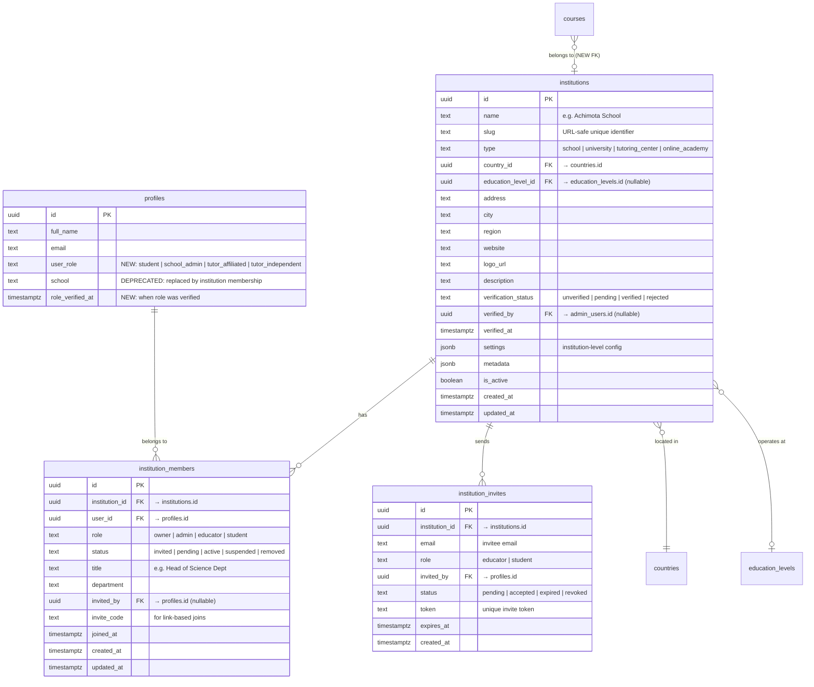

# Educator Platform Architecture

> **Technical Design Document — StuddyHub**
> Version 1.0 | February 22, 2026
> Status: **Proposal / RFC**
> Prerequisites: [EDUCATIONAL_CONTEXT_ARCHITECTURE.md](EDUCATIONAL_CONTEXT_ARCHITECTURE.md), [FEATURE_ALIGNMENT_STRATEGY.md](FEATURE_ALIGNMENT_STRATEGY.md)

---

## Table of Contents

1. [Executive Summary](#1-executive-summary)
2. [Current State Analysis](#2-current-state-analysis)
3. [Role-Based Access Control (RBAC) Schema](#3-role-based-access-control-rbac-schema)
4. [Educator Onboarding Flows](#4-educator-onboarding-flows)
5. [Dashboard & Feature Design per Role](#5-dashboard--feature-design-per-role)
6. [Permissions & Content Visibility](#6-permissions--content-visibility)
7. [RLS Policy Definitions](#7-rls-policy-definitions)
8. [Integration with Educational Contextualization](#8-integration-with-educational-contextualization)
9. [Frontend Architecture](#9-frontend-architecture)
10. [Migration Strategy](#10-migration-strategy)
11. [Complete File Inventory](#11-complete-file-inventory)
12. [Open Questions & Risks](#12-open-questions--risks)

---

## 1. Executive Summary

### Problem

StuddyHub has two user archetypes today: **students** (the default) and **platform admins** (via the `admin_users` table). There is no concept of an educator — a teacher, tutor, or school administrator who creates content for students but doesn't need platform-wide admin powers. Course creation is admin-gated, institution identity is a free-text string, and there is no way to scope content to a specific school's students.

### Proposed Solution

Introduce an **Educator Platform** layer that:

1. Formalizes **institutions** as first-class database entities with verified ownership.
2. Adds **educator roles** (`school_admin`, `tutor_affiliated`, `tutor_independent`) without disrupting the existing `admin_users` system.
3. Provides **role-specific dashboards** with content creation, student analytics, and institution management tools.
4. Enforces **institution-scoped content visibility** via PostgreSQL Row Level Security, ensuring School A's private content is invisible to School B's students.
5. Integrates cleanly with the Educational Contextualization framework (countries, education levels, curricula).

### Design Principles

| Principle | Implication |
|---|---|
| **Additive, not disruptive** | The existing student experience and admin system remain unchanged. Educator features are layered on top. |
| **Institution as a trust boundary** | Content visibility, student grouping, and analytics are all scoped by institution membership. |
| **Progressive role escalation** | A user starts as a student. They apply/are invited to become an educator. Role upgrades never destroy student data. |
| **Separation of platform admin and institution admin** | A `school_admin` manages their institution. A `super_admin` manages the platform. These are independent axes of authority. |

---

## 2. Current State Analysis

### What Exists

| Concept | Current Implementation | Limitation |
|---|---|---|
| **User roles** | `admin_users` table with `admin_role` enum (`super_admin`, `admin`, `moderator`) | Binary: you're a platform admin or a regular user. No educator/teacher role. |
| **Institutions** | `profiles.school` (free text), `courses.school_name` (free text) | No structured entity. "KNUST" and "knust" are different institutions. No ownership, no membership, no verification. |
| **Course creation** | Admin-only via RLS on `course_resources` | Teachers cannot create or manage courses. Only platform admins can. |
| **Content visibility** | All courses visible to all authenticated users. Documents/quizzes are owner-only. | No institution-scoped visibility. No "private to my school" content. |
| **Student-institution link** | String matching `profiles.school` ↔ `courses.school_name` | Fragile, unverifiable, no referential integrity. |
| **Educational context** | Proposed in `EDUCATIONAL_CONTEXT_ARCHITECTURE.md` (not yet implemented) | `user_education_profiles.institution_name` is still free text. |

### What's Missing

- `institutions` table with verified ownership
- `institution_members` table linking users to institutions with roles
- Educator-specific role column on user profiles
- Institution-scoped RLS policies
- Educator dashboard and content management UI
- Invitation/approval workflows for institution membership

---

## 3. Role-Based Access Control (RBAC) Schema

### 3.1 Role Hierarchy


**Key distinction:** Platform roles (`admin_users` table) and educator roles (`institution_members` / `profiles`) are **orthogonal**. A user can be both a `school_admin` and a platform `moderator`. The two systems do not interfere.

### 3.2 Entity-Relationship Diagram



### 3.3 Table Definitions

#### `profiles` — Modifications

```sql
-- Add user_role column with default 'student'
ALTER TABLE profiles
  ADD COLUMN user_role text NOT NULL DEFAULT 'student'
    CHECK (user_role IN ('student', 'school_admin', 'tutor_affiliated', 'tutor_independent')),
  ADD COLUMN role_verified_at timestamptz;

COMMENT ON COLUMN profiles.user_role IS 'Primary user role. Does not affect platform admin status (admin_users table).';
COMMENT ON COLUMN profiles.school IS 'DEPRECATED: Use institution_members for institution affiliation.';
```

#### `institutions`

```sql
CREATE TABLE institutions (
    id                  uuid PRIMARY KEY DEFAULT gen_random_uuid(),
    name                text NOT NULL,
    slug                text NOT NULL UNIQUE,
    type                text NOT NULL DEFAULT 'school'
                        CHECK (type IN ('school', 'university', 'tutoring_center', 'online_academy')),
    country_id          uuid REFERENCES countries(id),
    education_level_id  uuid REFERENCES education_levels(id),
    address             text,
    city                text,
    region              text,
    website             text,
    logo_url            text,
    description         text,
    verification_status text NOT NULL DEFAULT 'unverified'
                        CHECK (verification_status IN ('unverified', 'pending', 'verified', 'rejected')),
    verified_by         uuid REFERENCES admin_users(id),
    verified_at         timestamptz,
    settings            jsonb DEFAULT '{}'::jsonb,
    metadata            jsonb DEFAULT '{}'::jsonb,
    is_active           boolean DEFAULT true,
    created_at          timestamptz DEFAULT now(),
    updated_at          timestamptz DEFAULT now()
);

CREATE INDEX idx_institutions_country ON institutions(country_id);
CREATE INDEX idx_institutions_slug ON institutions(slug);
CREATE INDEX idx_institutions_type ON institutions(type);
CREATE INDEX idx_institutions_verification ON institutions(verification_status);

ALTER TABLE institutions ENABLE ROW LEVEL SECURITY;
```

#### `institution_members`

```sql
CREATE TABLE institution_members (
    id              uuid PRIMARY KEY DEFAULT gen_random_uuid(),
    institution_id  uuid NOT NULL REFERENCES institutions(id) ON DELETE CASCADE,
    user_id         uuid NOT NULL REFERENCES auth.users(id) ON DELETE CASCADE,
    role            text NOT NULL DEFAULT 'student'
                    CHECK (role IN ('owner', 'admin', 'educator', 'student')),
    status          text NOT NULL DEFAULT 'pending'
                    CHECK (status IN ('invited', 'pending', 'active', 'suspended', 'removed')),
    title           text,                         -- e.g. "Head of Science Department"
    department      text,                         -- e.g. "Sciences"
    invited_by      uuid REFERENCES auth.users(id),
    invite_code     text,
    joined_at       timestamptz,
    created_at      timestamptz DEFAULT now(),
    updated_at      timestamptz DEFAULT now(),
    UNIQUE(institution_id, user_id)
);

CREATE INDEX idx_institution_members_user ON institution_members(user_id);
CREATE INDEX idx_institution_members_institution ON institution_members(institution_id);
CREATE INDEX idx_institution_members_role ON institution_members(role);
CREATE INDEX idx_institution_members_status ON institution_members(status) WHERE status = 'active';

ALTER TABLE institution_members ENABLE ROW LEVEL SECURITY;
```

#### `institution_invites`

```sql
CREATE TABLE institution_invites (
    id              uuid PRIMARY KEY DEFAULT gen_random_uuid(),
    institution_id  uuid NOT NULL REFERENCES institutions(id) ON DELETE CASCADE,
    email           text NOT NULL,
    role            text NOT NULL DEFAULT 'educator'
                    CHECK (role IN ('educator', 'student')),
    invited_by      uuid NOT NULL REFERENCES auth.users(id),
    status          text NOT NULL DEFAULT 'pending'
                    CHECK (status IN ('pending', 'accepted', 'expired', 'revoked')),
    token           text NOT NULL UNIQUE DEFAULT encode(gen_random_bytes(32), 'hex'),
    expires_at      timestamptz DEFAULT (now() + interval '7 days'),
    created_at      timestamptz DEFAULT now(),
    UNIQUE(institution_id, email, status)
);

CREATE INDEX idx_institution_invites_token ON institution_invites(token);
CREATE INDEX idx_institution_invites_email ON institution_invites(email);

ALTER TABLE institution_invites ENABLE ROW LEVEL SECURITY;
```

#### `courses` — Modifications

```sql
-- Add institution ownership and visibility control
ALTER TABLE courses
  ADD COLUMN institution_id uuid REFERENCES institutions(id),
  ADD COLUMN created_by uuid REFERENCES auth.users(id),
  ADD COLUMN visibility text NOT NULL DEFAULT 'institution'
    CHECK (visibility IN ('institution', 'public', 'unlisted')),
  ADD COLUMN is_published boolean DEFAULT false;

CREATE INDEX idx_courses_institution ON courses(institution_id);
CREATE INDEX idx_courses_created_by ON courses(created_by);
CREATE INDEX idx_courses_visibility ON courses(visibility);

COMMENT ON COLUMN courses.visibility IS
  'institution = only members of the owning institution can see/enroll. public = anyone. unlisted = direct link only.';
COMMENT ON COLUMN courses.is_published IS
  'Draft courses (false) are visible only to the creator and institution admins.';
```

### 3.4 Helper Functions

```sql
-- Check if a user is a member of a specific institution with a minimum role
CREATE OR REPLACE FUNCTION is_institution_member(
    _user_id uuid,
    _institution_id uuid,
    _min_role text DEFAULT 'student'
)
RETURNS boolean
LANGUAGE plpgsql
SECURITY DEFINER
SET search_path = public
AS $$
DECLARE
    _role_rank integer;
    _user_rank integer;
BEGIN
    -- Role hierarchy: owner=4, admin=3, educator=2, student=1
    _role_rank := CASE _min_role
        WHEN 'owner' THEN 4
        WHEN 'admin' THEN 3
        WHEN 'educator' THEN 2
        WHEN 'student' THEN 1
        ELSE 0
    END;

    SELECT CASE im.role
        WHEN 'owner' THEN 4
        WHEN 'admin' THEN 3
        WHEN 'educator' THEN 2
        WHEN 'student' THEN 1
        ELSE 0
    END INTO _user_rank
    FROM institution_members im
    WHERE im.user_id = _user_id
      AND im.institution_id = _institution_id
      AND im.status = 'active';

    RETURN COALESCE(_user_rank >= _role_rank, false);
END;
$$;

-- Check if a user belongs to ANY institution at a given role or above
CREATE OR REPLACE FUNCTION is_educator(_user_id uuid)
RETURNS boolean
LANGUAGE plpgsql
SECURITY DEFINER
SET search_path = public
AS $$
BEGIN
    RETURN EXISTS (
        SELECT 1 FROM institution_members im
        WHERE im.user_id = _user_id
          AND im.role IN ('owner', 'admin', 'educator')
          AND im.status = 'active'
    );
END;
$$;

-- Get all institution IDs that the user belongs to
CREATE OR REPLACE FUNCTION user_institution_ids(_user_id uuid)
RETURNS SETOF uuid
LANGUAGE sql
SECURITY DEFINER
SET search_path = public
AS $$
    SELECT institution_id
    FROM institution_members
    WHERE user_id = _user_id AND status = 'active';
$$;
```

---

## 4. Educator Onboarding Flows

### 4.1 Flow Overview


### 4.2 Flow A: School Administrator — Creating a New Institution

**Step 1 — Role Selection** (in enhanced `OnboardingWizard.tsx`)
```
"What best describes your role?" → "School Administrator"
```

**Step 2 — Institution Details**
| Field | Required | Notes |
|---|---|---|
| Institution name | Yes | Auto-generates slug |
| Type | Yes | School / University / Tutoring Center / Online Academy |
| Country | Yes | Dropdown from `countries` table |
| Education level | Conditional | If type is `school` — dropdown filtered by country |
| City / Region | Yes | |
| Address | No | |
| Website | No | |
| Logo | No | Upload to `institution-logos` storage bucket |
| Description | No | |

**Step 3 — Verification**
- Upload proof of authority (school accreditation letter, appointment letter, etc.)
- Files stored in a `institution-verification` private storage bucket.
- Status set to `pending`. Platform admin reviews and approves/rejects.

**Step 4 — Pending State**
- The user can access a limited educator dashboard showing "Verification Pending."
- Once a `super_admin` or `admin` approves, `institutions.verification_status` → `'verified'`, `profiles.user_role` → `'school_admin'`, `profiles.role_verified_at` ← now().
- An `institution_members` row is created with `role: 'owner'`, `status: 'active'`.

**Edge function:** `supabase/functions/create-institution/index.ts` — validates input, creates `institutions` row, creates `institution_members` row with `role: 'owner'` and `status: 'pending'`, triggers notification to platform admins.

### 4.3 Flow B: Affiliated Tutor — Joining an Existing Institution

**Step 1 — Role Selection**
```
"What best describes your role?" → "Teacher at a School"
```

**Step 2 — Find Institution**
Two paths:
- **Search:** Type institution name → autocomplete from `institutions` table (only `is_active` and `verified` or `unverified`).
- **Invite code/link:** Paste a URL like `studdyhub.com/join/abc123def` which resolves to an `institution_invites` row.

**Step 3a — Via Search (request-based)**
- User selects institution → `institution_members` row created with `status: 'pending'`, `role: 'educator'`.
- The institution's `owner` / `admin` sees the request in their dashboard and approves or rejects.
- On approval: `status` → `'active'`, `profiles.user_role` → `'tutor_affiliated'`.

**Step 3b — Via Invite Code (auto-join)**
- Validate `institution_invites.token` — check not expired, not revoked.
- Auto-create `institution_members` row with `status: 'active'`, `role` from the invite.
- Update `institution_invites.status` → `'accepted'`.
- Set `profiles.user_role` → `'tutor_affiliated'`.

### 4.4 Flow C: Independent Tutor

**Step 1 — Role Selection**
```
"What best describes your role?" → "Independent Tutor"
```

**Step 2 — Profile Enhancement**
| Field | Required |
|---|---|
| Subjects taught | Yes (multi-select from `subjects` table, filtered by selected country/curriculum) |
| Years of experience | No |
| Qualifications | No (free text or credential upload) |
| Bio / About | No |

**Step 3 — Immediate Activation**
- `profiles.user_role` → `'tutor_independent'`. No institution needed.
- The tutor can immediately create public courses and content.
- Optional: submit credentials for a "Verified Tutor" badge (`profiles.role_verified_at`).

### 4.5 Student Join Flow (Institution Membership)

Students join institutions separately from educator onboarding:

1. **During onboarding:** After selecting country + education level in `EducationContextStep`, the system searches for matching `institutions` and asks: "Are you enrolled at one of these schools?"
2. **Via invite link:** A school_admin shares a student invite link → `institution_invites` with `role: 'student'`.
3. **Via settings:** User navigates to Settings → Education → "Join an Institution."

On joining, an `institution_members` row is created with `role: 'student'`. This enables scoped content visibility.

---

## 5. Dashboard & Feature Design per Role

### 5.1 Role-to-Feature Matrix


### 5.2 School Administrator Dashboard

**Route:** `/educator/admin`

| Tab | Component | Features |
|---|---|---|
| **Overview** | `InstitutionOverview` | Total students, total educators, active courses, enrollment trends (line chart), top courses by enrollment |
| **Members** | `MemberManagement` | Invite educators (via email or link), invite students (bulk CSV import or link), approve/reject pending requests, change member roles, suspend/remove members |
| **Courses** | `InstitutionCourses` | View all courses by institution educators, approve/unpublish courses, see enrollment counts per course, filter by department/level/educator |
| **Analytics** | `InstitutionAnalytics` | Aggregated student performance per course, quiz score distributions, study time heatmaps, at-risk students (low activity), subject-level pass rates |
| **Settings** | `InstitutionSettings` | Edit institution profile, manage departments, set default course visibility, manage invite links, verification status |

**Key actions:**

```typescript
// Permissions for school_admin
interface SchoolAdminPermissions {
  canInviteEducators: true;
  canInviteStudents: true;
  canApproveMembership: true;
  canRemoveMembers: true;       // except other owners
  canCreateCourses: true;
  canPublishCourses: true;      // approve educator-created courses
  canViewAllStudentAnalytics: true;
  canEditInstitutionSettings: true;
  canManageDepartments: true;
  canGenerateInviteLinks: true;
}
```

### 5.3 Affiliated Tutor Dashboard

**Route:** `/educator/dashboard`

| Tab | Component | Features |
|---|---|---|
| **My Courses** | `EducatorCourses` | Create new course (auto-scoped to institution), edit/archive own courses, AI-generate resources per course, manage course materials (upload, link, reorder) |
| **Students** | `CourseStudents` | Per-course roster (enrolled students), individual student progress view, quiz attempt breakdown per student, activity timeline |
| **Content** | `ContentManager` | Manage quizzes, notes, podcasts, flashcards created for courses. Bulk operations. Import existing personal content into a course. |
| **Schedule** | `ClassSchedule` | Create class schedules visible to enrolled students, link to class recordings |

**Key actions:**

```typescript
interface AffiliatedTutorPermissions {
  canCreateCourses: true;                // within their institution
  canPublishCourses: false;              // requires school_admin approval
  canEditOwnCourses: true;
  canViewEnrolledStudentAnalytics: true; // only for students in their courses
  canGenerateAIResources: true;
  canAssignQuizzes: true;
  canCreateScheduleItems: true;
  canInviteStudents: false;              // only school_admin
}
```

**Course creation flow for affiliated tutor:**


### 5.4 Independent Tutor Dashboard

**Route:** `/educator/dashboard` (same route, different context)

| Tab | Component | Features |
|---|---|---|
| **My Courses** | `EducatorCourses` | Create courses with `visibility: 'public'` or `'unlisted'`, self-publish (no approval needed), share enrollment links |
| **Students** | `CourseStudents` | Same as affiliated tutor |
| **Content** | `ContentManager` | Same as affiliated tutor |
| **Profile** | `TutorProfile` | Public educator profile, subjects taught, ratings/reviews (future), student count |

**Key actions:**

```typescript
interface IndependentTutorPermissions {
  canCreateCourses: true;                // public or unlisted only
  canPublishCourses: true;               // self-publish
  canEditOwnCourses: true;
  canViewEnrolledStudentAnalytics: true;
  canGenerateAIResources: true;
  canAssignQuizzes: true;
  canSetCourseVisibility: true;          // public | unlisted (not institution)
}
```

---

## 6. Permissions & Content Visibility

### 6.1 Content Access Matrix

| Content Type | `visibility: 'public'` | `visibility: 'institution'` | `visibility: 'unlisted'` | Draft (`is_published: false`) |
|---|---|---|---|---|
| **Courses** | All authenticated users | Active members of owning institution only | Anyone with direct link | Creator + institution admins only |
| **Course Resources** | Any enrolled student | Any enrolled student (enrollment gated by course visibility) | Any enrolled student | Creator + institution admins only |
| **Quizzes (course-linked)** | Access via enrollment | Access via enrollment | Access via enrollment | Creator only |
| **Documents (course-linked)** | Access via enrollment, marked `is_public` | Access via enrollment | Access via enrollment | Creator only |

### 6.2 Visibility Decision Flowchart


### 6.3 Concrete Scenario: School A vs. School B

> **Scenario:** Tutor X at "Achimota School" creates a quiz for their SHS Chemistry course. Student Y at "Presec Legon" tries to access it.

**Data state:**
- `courses` row: `institution_id = achimota_id`, `visibility = 'institution'`, `is_published = true`
- `course_resources` row: links quiz to the course
- Student Y is in `institution_members` for Presec, NOT for Achimota

**Access check (RLS policy on `courses`):**
```sql
-- Student Y tries: SELECT * FROM courses WHERE id = <course_id>
-- Policy evaluates:
visibility = 'institution'
  AND is_institution_member(auth.uid(), institution_id)
-- is_institution_member(student_y_id, achimota_id) → false
-- → Row not returned. Student Y cannot see the course.
```

**Student Y also cannot:**
- See the course in Course Library (RLS blocks SELECT)
- Enroll in it (can't reference a course they can't SELECT)
- Access course resources (enrollment check fails)
- See the quiz directly (quiz is linked to an invisible course)

---

## 7. RLS Policy Definitions

### 7.1 `institutions`

```sql
-- Anyone authenticated can view active institutions (for search/join)
CREATE POLICY "institutions_select_active" ON institutions
    FOR SELECT USING (
        is_active = true
        OR is_institution_member(auth.uid(), id, 'admin')
        OR is_admin()
    );

-- Only institution admins can update their own institution
CREATE POLICY "institutions_update_admin" ON institutions
    FOR UPDATE USING (
        is_institution_member(auth.uid(), id, 'admin')
    ) WITH CHECK (
        is_institution_member(auth.uid(), id, 'admin')
    );

-- Only authenticated users can create (application flow)
CREATE POLICY "institutions_insert_authenticated" ON institutions
    FOR INSERT WITH CHECK (
        auth.role() = 'authenticated'
    );

-- Only platform super_admin can delete
CREATE POLICY "institutions_delete_superadmin" ON institutions
    FOR DELETE USING (
        is_admin(auth.uid(), 'super_admin'::admin_role)
    );
```

### 7.2 `institution_members`

```sql
-- Users can see members of institutions they belong to
CREATE POLICY "members_select_same_institution" ON institution_members
    FOR SELECT USING (
        institution_id IN (SELECT user_institution_ids(auth.uid()))
        OR user_id = auth.uid()
        OR is_admin()
    );

-- Institution admins can insert (invite/add members)
CREATE POLICY "members_insert_admin" ON institution_members
    FOR INSERT WITH CHECK (
        is_institution_member(auth.uid(), institution_id, 'admin')
        OR user_id = auth.uid()  -- self-request to join
    );

-- Institution admins can update member status/role
CREATE POLICY "members_update_admin" ON institution_members
    FOR UPDATE USING (
        is_institution_member(auth.uid(), institution_id, 'admin')
    ) WITH CHECK (
        is_institution_member(auth.uid(), institution_id, 'admin')
    );

-- Institution owners can remove members, or members can remove themselves
CREATE POLICY "members_delete" ON institution_members
    FOR DELETE USING (
        user_id = auth.uid()  -- self-leave
        OR is_institution_member(auth.uid(), institution_id, 'owner')
    );
```

### 7.3 `courses` — Enhanced Policies

The existing "Anyone can view courses" policy must be replaced with visibility-aware policies:

```sql
-- Drop old broad policy
DROP POLICY IF EXISTS "Anyone can view courses" ON courses;

-- New: Visibility-scoped SELECT
CREATE POLICY "courses_select_visible" ON courses
    FOR SELECT USING (
        -- Public + published: anyone
        (visibility = 'public' AND is_published = true)
        -- Institution: only members
        OR (visibility = 'institution' AND is_published = true
            AND is_institution_member(auth.uid(), institution_id))
        -- Unlisted + published: anyone (they need the link, but RLS allows it)
        OR (visibility = 'unlisted' AND is_published = true)
        -- Drafts: creator or institution admin
        OR (is_published = false AND (
            created_by = auth.uid()
            OR is_institution_member(auth.uid(), institution_id, 'admin')
        ))
        -- Legacy courses (no institution_id): everyone can see
        OR institution_id IS NULL
        -- Platform admin override
        OR is_admin()
    );

-- Educators can create courses
CREATE POLICY "courses_insert_educator" ON courses
    FOR INSERT WITH CHECK (
        -- Affiliated educator: must set their institution_id
        (is_institution_member(auth.uid(), institution_id, 'educator')
         AND created_by = auth.uid())
        -- Independent tutor: institution_id must be null, visibility must not be 'institution'
        OR (institution_id IS NULL
            AND created_by = auth.uid()
            AND visibility != 'institution'
            AND (SELECT user_role FROM profiles WHERE id = auth.uid()) = 'tutor_independent')
        -- Platform admin (existing behavior)
        OR is_admin()
    );

-- Course owners and institution admins can update
CREATE POLICY "courses_update_owner" ON courses
    FOR UPDATE USING (
        created_by = auth.uid()
        OR is_institution_member(auth.uid(), institution_id, 'admin')
        OR is_admin()
    ) WITH CHECK (
        created_by = auth.uid()
        OR is_institution_member(auth.uid(), institution_id, 'admin')
        OR is_admin()
    );

-- Only institution admins and platform admins can delete
CREATE POLICY "courses_delete_admin" ON courses
    FOR DELETE USING (
        is_institution_member(auth.uid(), institution_id, 'admin')
        OR is_admin()
    );
```

### 7.4 `course_resources` — Enhanced Policies

```sql
-- Drop old admin-only write policies
DROP POLICY IF EXISTS "Admins can insert course resources" ON course_resources;
DROP POLICY IF EXISTS "Admins can delete course resources" ON course_resources;
DROP POLICY IF EXISTS "Admins can update course resources" ON course_resources;

-- Educators of the owning institution can manage resources
CREATE POLICY "course_resources_insert_educator" ON course_resources
    FOR INSERT WITH CHECK (
        EXISTS (
            SELECT 1 FROM courses c
            WHERE c.id = course_id
            AND (
                c.created_by = auth.uid()
                OR is_institution_member(auth.uid(), c.institution_id, 'educator')
                OR is_admin()
            )
        )
    );

CREATE POLICY "course_resources_update_educator" ON course_resources
    FOR UPDATE USING (
        EXISTS (
            SELECT 1 FROM courses c
            WHERE c.id = course_id
            AND (
                c.created_by = auth.uid()
                OR is_institution_member(auth.uid(), c.institution_id, 'educator')
                OR is_admin()
            )
        )
    );

CREATE POLICY "course_resources_delete_educator" ON course_resources
    FOR DELETE USING (
        EXISTS (
            SELECT 1 FROM courses c
            WHERE c.id = course_id
            AND (
                c.created_by = auth.uid()
                OR is_institution_member(auth.uid(), c.institution_id, 'admin')
                OR is_admin()
            )
        )
    );

-- Read: must be enrolled or be an educator of the course's institution
CREATE POLICY "course_resources_select" ON course_resources
    FOR SELECT USING (
        EXISTS (
            SELECT 1 FROM courses c
            WHERE c.id = course_id
            AND (
                -- Course is visible to user (delegates to courses RLS)
                c.institution_id IS NULL  -- legacy courses
                OR c.visibility = 'public'
                OR is_institution_member(auth.uid(), c.institution_id)
                OR is_admin()
            )
        )
    );
```

### 7.5 `course_enrollments` — Enhanced Policies

```sql
-- Users can only enroll in courses they can see
-- (The courses_select_visible RLS on `courses` already gates this via FK)
-- But add explicit enrollment gating:
CREATE POLICY "enrollments_insert_visible_course" ON course_enrollments
    FOR INSERT WITH CHECK (
        auth.uid() = user_id
        AND EXISTS (
            SELECT 1 FROM courses c
            WHERE c.id = course_id
            AND c.is_published = true
            AND (
                c.visibility = 'public'
                OR c.visibility = 'unlisted'
                OR (c.visibility = 'institution'
                    AND is_institution_member(auth.uid(), c.institution_id))
                OR c.institution_id IS NULL
            )
        )
    );
```

### 7.6 Performance Consideration: Caching `is_institution_member`

The `is_institution_member()` function is called in many RLS policies. To avoid N+1 queries, PostgreSQL caches the result within a single statement. However, for complex pages with many table accesses, consider a **session-scoped materialized CTE** or a **`current_setting()` approach**:

```sql
-- Alternative: Set institution IDs in a session variable at connection time
-- (in an auth hook or RPC called on login)
CREATE OR REPLACE FUNCTION set_user_context()
RETURNS void
LANGUAGE plpgsql
SECURITY DEFINER
SET search_path = public
AS $$
BEGIN
    PERFORM set_config(
        'app.user_institution_ids',
        COALESCE(
            (SELECT string_agg(institution_id::text, ',')
             FROM institution_members
             WHERE user_id = auth.uid() AND status = 'active'),
            ''
        ),
        true  -- is_local (transaction-scoped)
    );
END;
$$;
```

This is an **optimization** to consider during load testing, not a requirement for MVP.

---

## 8. Integration with Educational Contextualization

### 8.1 Linking Institutions to the Education Framework

The `institutions` table has `country_id` and `education_level_id` FKs:

```
institutions.country_id    → countries.id         (e.g., Ghana)
institutions.education_level_id → education_levels.id  (e.g., SHS, University)
```

This enables:
- **Student onboarding:** When a student selects "Ghana → SHS" in the education context wizard, the system can suggest institutions matching that country + level.
- **Course filtering:** Courses from an institution inherit its educational context for filtering.
- **Analytics:** Platform admins can view stats by country → education level → institution.

### 8.2 Linking `user_education_profiles` to Institutions

When a student or educator joins an institution, the `user_education_profiles.institution_name` field can be auto-populated:

```sql
-- Trigger: auto-sync institution name to education profile on membership activation
CREATE OR REPLACE FUNCTION sync_institution_to_education_profile()
RETURNS trigger
LANGUAGE plpgsql
SECURITY DEFINER
SET search_path = public
AS $$
BEGIN
    IF NEW.status = 'active' THEN
        INSERT INTO user_education_profiles (user_id, institution_name, country_id)
        SELECT NEW.user_id, i.name, i.country_id
        FROM institutions i WHERE i.id = NEW.institution_id
        ON CONFLICT (user_id) DO UPDATE SET
            institution_name = EXCLUDED.institution_name;
    END IF;
    RETURN NEW;
END;
$$;

CREATE TRIGGER trg_sync_institution_education
    AFTER INSERT OR UPDATE ON institution_members
    FOR EACH ROW
    EXECUTE FUNCTION sync_institution_to_education_profile();
```

### 8.3 Course-Curriculum Alignment

Educators creating courses can tag them with a `curriculum_id` (from `EDUCATIONAL_CONTEXT_ARCHITECTURE.md`). Combined with the institution's `education_level_id`, this enables:

- "WASSCE Chemistry" courses grouped separately from "University Chemistry 101"
- Students in the "For You" course tab seeing courses aligned to their curriculum
- AI-generated quiz content using the curriculum context

---

## 9. Frontend Architecture

### 9.1 New Route Structure

```typescript
// In App.tsx — new routes under /educator
<Route path="/educator" element={<ProtectedRoute><EducatorLayout /></ProtectedRoute>}>
  {/* School Admin routes */}
  <Route path="admin" element={<InstitutionAdminDashboard />} />
  <Route path="admin/members" element={<MemberManagement />} />
  <Route path="admin/analytics" element={<InstitutionAnalytics />} />
  <Route path="admin/settings" element={<InstitutionSettings />} />

  {/* Shared educator routes */}
  <Route path="dashboard" element={<EducatorDashboard />} />
  <Route path="courses" element={<EducatorCourses />} />
  <Route path="courses/new" element={<CreateCourse />} />
  <Route path="courses/:courseId/edit" element={<EditCourse />} />
  <Route path="courses/:courseId/students" element={<CourseStudents />} />
  <Route path="courses/:courseId/analytics" element={<CourseAnalytics />} />
  <Route path="content" element={<ContentManager />} />
</Route>

{/* Institution join flow */}
<Route path="/join/:inviteToken" element={<JoinInstitution />} />
```

### 9.2 New Components Directory

```
src/components/educator/
├── EducatorLayout.tsx                    # Sidebar + header for educator views
├── EducatorDashboard.tsx                 # Role-aware dashboard (switches by role)
├── EducatorGuard.tsx                     # Route guard: redirects non-educators
├── institution/
│   ├── InstitutionAdminDashboard.tsx     # school_admin overview
│   ├── InstitutionOverview.tsx           # Stats cards, charts
│   ├── InstitutionSettings.tsx           # Edit institution details
│   ├── MemberManagement.tsx             # Invite, approve, manage members
│   ├── MemberInviteDialog.tsx           # Email/link invite form
│   ├── MemberRequestCard.tsx            # Pending request approval card
│   ├── InstitutionAnalytics.tsx         # Student performance dashboards
│   └── DepartmentManager.tsx            # Manage departments
├── courses/
│   ├── EducatorCourses.tsx              # List of educator's own courses
│   ├── CreateCourseForm.tsx             # Course creation wizard
│   ├── EditCourseForm.tsx               # Course editing
│   ├── CourseStudents.tsx               # Enrolled student roster + progress
│   ├── CourseAnalyticsView.tsx          # Per-course performance charts
│   └── CourseResourceManager.tsx        # Add/remove/reorder resources
├── content/
│   ├── ContentManager.tsx               # Manage all educator-created content
│   └── ContentImportDialog.tsx          # Import personal notes/quizzes into a course
├── onboarding/
│   ├── EducatorRoleStep.tsx             # "I am a..." role selection
│   ├── CreateInstitutionFlow.tsx        # Multi-step institution creation
│   ├── JoinInstitutionFlow.tsx          # Search/invite code join
│   └── IndependentTutorSetup.tsx        # Independent tutor profile
└── hooks/
    ├── useInstitution.ts                # Fetch current user's institution
    ├── useInstitutionMembers.ts         # Member CRUD operations
    ├── useEducatorPermissions.ts        # Computed permission object
    └── useEducatorCourses.ts            # Educator-side course management
```

### 9.3 New Hooks

#### `useEducatorPermissions`

```typescript
// src/components/educator/hooks/useEducatorPermissions.ts

interface EducatorPermissions {
  isEducator: boolean;
  role: 'school_admin' | 'tutor_affiliated' | 'tutor_independent' | null;
  institutionRole: 'owner' | 'admin' | 'educator' | null;
  institutionId: string | null;
  institutionName: string | null;
  canCreateCourses: boolean;
  canPublishCourses: boolean;
  canManageMembers: boolean;
  canViewInstitutionAnalytics: boolean;
  canEditInstitutionSettings: boolean;
  canInviteStudents: boolean;
  canInviteEducators: boolean;
}

function useEducatorPermissions(): EducatorPermissions {
  const { userProfile } = useAppContext();
  const { data: membership } = useQuery({
    queryKey: ['institution-membership', userProfile?.id],
    queryFn: () => supabase
      .from('institution_members')
      .select('*, institution:institutions(*)')
      .eq('user_id', userProfile?.id)
      .eq('status', 'active')
      .in('role', ['owner', 'admin', 'educator'])
      .maybeSingle(),
    enabled: !!userProfile?.id,
  });

  return useMemo(() => {
    const userRole = userProfile?.user_role;
    const instRole = membership?.role;

    return {
      isEducator: ['school_admin', 'tutor_affiliated', 'tutor_independent'].includes(userRole),
      role: userRole as any,
      institutionRole: instRole as any,
      institutionId: membership?.institution_id ?? null,
      institutionName: membership?.institution?.name ?? null,
      canCreateCourses: !!instRole || userRole === 'tutor_independent',
      canPublishCourses: ['owner', 'admin'].includes(instRole) || userRole === 'tutor_independent',
      canManageMembers: ['owner', 'admin'].includes(instRole),
      canViewInstitutionAnalytics: ['owner', 'admin'].includes(instRole),
      canEditInstitutionSettings: ['owner', 'admin'].includes(instRole),
      canInviteStudents: ['owner', 'admin'].includes(instRole),
      canInviteEducators: ['owner', 'admin'].includes(instRole),
    };
  }, [userProfile, membership]);
}
```

#### `useInstitution`

```typescript
// src/components/educator/hooks/useInstitution.ts

function useInstitution(institutionId: string | null) {
  return useQuery({
    queryKey: ['institution', institutionId],
    queryFn: () => supabase
      .from('institutions')
      .select(`
        *,
        country:countries(code, name, flag_emoji),
        education_level:education_levels(code, name, short_name),
        member_count:institution_members(count).filter(status.eq.active),
        educator_count:institution_members(count).filter(status.eq.active,role.in.(owner,admin,educator)),
        student_count:institution_members(count).filter(status.eq.active,role.eq.student)
      `)
      .eq('id', institutionId)
      .single(),
    enabled: !!institutionId,
  });
}
```

### 9.4 State Management Integration

Add to `AppContextType`:

```typescript
// In AppContext.tsx
interface AppContextType extends AppState {
  // ...existing fields...
  educatorPermissions: EducatorPermissions;  // NEW
}
```

The `useEducatorPermissions` hook is called inside `AppProvider` and exposed via context, making educator role info available globally without prop drilling.

### 9.5 Navigation: Educator Switcher

A global "Switch to Educator" toggle in the sidebar (or header) for users with educator roles:

```tsx
// In layout/Sidebar.tsx or layout/Header.tsx
function RoleSwitcher() {
  const { educatorPermissions } = useAppContext();

  if (!educatorPermissions.isEducator) return null;

  return (
    <Link to="/educator/dashboard">
      <Button variant="outline" size="sm" className="gap-2">
        <GraduationCap className="h-4 w-4" />
        Educator Dashboard
      </Button>
    </Link>
  );
}
```

---

## 10. Migration Strategy

### Phase 1: Database Foundation (Week 1)

| Step | Deliverable |
|---|---|
| 1.1 | Migration: Add `user_role`, `role_verified_at` to `profiles` |
| 1.2 | Migration: Create `institutions` table |
| 1.3 | Migration: Create `institution_members` table |
| 1.4 | Migration: Create `institution_invites` table |
| 1.5 | Migration: Add `institution_id`, `created_by`, `visibility`, `is_published` to `courses` |
| 1.6 | Create helper functions: `is_institution_member()`, `is_educator()`, `user_institution_ids()` |
| 1.7 | Replace courses RLS policies with visibility-aware versions |
| 1.8 | Update `course_resources` and `course_enrollments` RLS policies |

### Phase 2: Backend (Week 2)

| Step | Deliverable |
|---|---|
| 2.1 | Edge function: `create-institution` |
| 2.2 | Edge function: `manage-institution-members` (invite, approve, remove) |
| 2.3 | Edge function: `accept-institution-invite` |
| 2.4 | RPC: `get_institution_analytics` (aggregated stats) |
| 2.5 | Update `generate-quiz` / `generate-podcast` to set `created_by` on resources |
| 2.6 | Trigger: `sync_institution_to_education_profile` |

### Phase 3: Frontend — Onboarding (Week 2–3)

| Step | Deliverable |
|---|---|
| 3.1 | `EducatorRoleStep` component (role selection in onboarding) |
| 3.2 | `CreateInstitutionFlow` (multi-step institution registration) |
| 3.3 | `JoinInstitutionFlow` (search + invite code) |
| 3.4 | `IndependentTutorSetup` (profile enhancement) |
| 3.5 | `/join/:inviteToken` page |

### Phase 4: Frontend — Educator Dashboard (Week 3–4)

| Step | Deliverable |
|---|---|
| 4.1 | `EducatorLayout`, `EducatorGuard`, route registration |
| 4.2 | `EducatorDashboard` (overview for all educator types) |
| 4.3 | `EducatorCourses` (list + create + edit) |
| 4.4 | `CourseResourceManager` (add/remove/reorder within a course) |
| 4.5 | `CourseStudents` (roster, progress, grades) |

### Phase 5: Frontend — Institution Admin (Week 4–5)

| Step | Deliverable |
|---|---|
| 5.1 | `InstitutionAdminDashboard` |
| 5.2 | `MemberManagement` (invite, approve, bulk import) |
| 5.3 | `InstitutionAnalytics` (charts, at-risk students) |
| 5.4 | `InstitutionSettings` |

### Phase 6: Platform Admin Integration (Week 5)

| Step | Deliverable |
|---|---|
| 6.1 | New admin tab: "Institutions" — list, verify, deactivate |
| 6.2 | Institution verification workflow in admin dashboard |
| 6.3 | Admin can promote users to educator roles |

### Data Migration for Existing Users

```sql
-- Backfill: set all existing users to 'student' (the default)
-- This is a no-op if the DEFAULT is already 'student', but explicit for clarity
UPDATE profiles SET user_role = 'student' WHERE user_role IS NULL;

-- Optional: Create institutions from existing distinct school_name values on courses
-- (only useful if there are existing courses with school_name values)
INSERT INTO institutions (name, slug, type, verification_status)
SELECT DISTINCT
    school_name,
    lower(regexp_replace(school_name, '[^a-zA-Z0-9]+', '-', 'g')),
    'university',
    'unverified'
FROM courses
WHERE school_name IS NOT NULL
  AND school_name != 'Global'
ON CONFLICT (slug) DO NOTHING;
```

---

## 11. Complete File Inventory

### New Database Files

| File | Purpose |
|---|---|
| `sql/20260301_educator_platform_schema.sql` | All table definitions, enums, constraints |
| `sql/20260301_educator_rls_policies.sql` | All new/updated RLS policies |
| `sql/20260301_educator_helper_functions.sql` | `is_institution_member()`, `is_educator()`, `user_institution_ids()` |
| `sql/20260301_educator_triggers.sql` | Sync triggers |
| `sql/20260301_seed_existing_institutions.sql` | Optional migration for existing `school_name` data |

### New Edge Functions

| File | Purpose |
|---|---|
| `supabase/functions/create-institution/index.ts` | Institution creation + owner membership |
| `supabase/functions/manage-institution-members/index.ts` | Invite, approve, remove, change role |
| `supabase/functions/accept-institution-invite/index.ts` | Token validation + auto-join |
| `supabase/functions/get-institution-analytics/index.ts` | Aggregated institution stats |
| `supabase/functions/_shared/institutionContext.ts` | Shared utilities for institution checks |

### New Frontend Files

| File | Purpose |
|---|---|
| `src/components/educator/EducatorLayout.tsx` | Sidebar + header for educator views |
| `src/components/educator/EducatorDashboard.tsx` | Role-aware dashboard |
| `src/components/educator/EducatorGuard.tsx` | Route guard for educator routes |
| `src/components/educator/institution/InstitutionAdminDashboard.tsx` | School admin overview |
| `src/components/educator/institution/InstitutionOverview.tsx` | Stats cards and charts |
| `src/components/educator/institution/InstitutionSettings.tsx` | Edit institution details |
| `src/components/educator/institution/MemberManagement.tsx` | Member CRUD |
| `src/components/educator/institution/MemberInviteDialog.tsx` | Invite form |
| `src/components/educator/institution/MemberRequestCard.tsx` | Pending request card |
| `src/components/educator/institution/InstitutionAnalytics.tsx` | Performance dashboards |
| `src/components/educator/institution/DepartmentManager.tsx` | Department CRUD |
| `src/components/educator/courses/EducatorCourses.tsx` | Course list + CRUD |
| `src/components/educator/courses/CreateCourseForm.tsx` | Course creation wizard |
| `src/components/educator/courses/EditCourseForm.tsx` | Course editing |
| `src/components/educator/courses/CourseStudents.tsx` | Student roster + progress |
| `src/components/educator/courses/CourseAnalyticsView.tsx` | Per-course analytics |
| `src/components/educator/courses/CourseResourceManager.tsx` | Resource management |
| `src/components/educator/content/ContentManager.tsx` | All educator content |
| `src/components/educator/content/ContentImportDialog.tsx` | Import personal content |
| `src/components/educator/onboarding/EducatorRoleStep.tsx` | Onboarding role selection |
| `src/components/educator/onboarding/CreateInstitutionFlow.tsx` | Institution creation wizard |
| `src/components/educator/onboarding/JoinInstitutionFlow.tsx` | Join via search/code |
| `src/components/educator/onboarding/IndependentTutorSetup.tsx` | Independent tutor profile |
| `src/components/educator/hooks/useInstitution.ts` | Institution data hook |
| `src/components/educator/hooks/useInstitutionMembers.ts` | Member CRUD hook |
| `src/components/educator/hooks/useEducatorPermissions.ts` | Permission computation |
| `src/components/educator/hooks/useEducatorCourses.ts` | Course management hook |
| `src/pages/JoinInstitution.tsx` | `/join/:inviteToken` page |
| `src/types/Institution.ts` | TypeScript types |

### Modified Files

| File | Changes |
|---|---|
| `src/App.tsx` | Add `/educator/*` and `/join/:token` routes |
| `src/contexts/AppContext.tsx` | Add `educatorPermissions` to context |
| `src/contexts/appReducer.ts` | No changes needed (permissions are derived, not dispatched) |
| `src/types/Document.ts` | Add `user_role`, `role_verified_at` to `UserProfile` interface |
| `src/components/onboarding/OnboardingWizard.tsx` | Add `EducatorRoleStep` to step flow |
| `src/components/userSettings/UserSettings.tsx` | Add "Institution" tab for managing membership |
| `src/components/layout/Sidebar.tsx` (or equivalent) | Add "Educator Dashboard" link for educator users |
| `src/hooks/useCourseLibrary.ts` | Update query to respect `visibility` + `institution_id` |
| `src/components/courseLibrary/CourseList.tsx` | Filter courses by visibility; show institution badge |
| `src/components/courseLibrary/CourseDetail.tsx` | Show "Created by {educator}" attribution |
| `src/components/courseLibrary/GenerateCourseResourcesDialog.tsx` | Enable for educators (not just admins) |
| `src/hooks/useFeatureAccess.tsx` | Add `isEducator`, `canCreateCourses` checks |
| `src/pages/CourseDashboard.tsx` | Show edit button for course creator; educator analytics tab |
| `src/components/admin/adminDashboard.tsx` | Add "Institutions" tab for platform admins |
| `src/services/courseAIGenerationService.ts` | Set `created_by` on generated resources |

---

## 12. Open Questions & Risks

| # | Question / Risk | Recommendation |
|---|---|---|
| 1 | **Can a user be in multiple institutions?** A teacher might work at two schools. | Yes. `institution_members` allows multiple rows per `user_id` (unique on `institution_id + user_id`). The `useEducatorPermissions` hook picks the "primary" one (e.g., most recently active). A "switch institution" dropdown is needed in the educator dashboard. |
| 2 | **What happens to an institution when the owner's account is deleted?** | Transfer ownership first. Add a pre-delete check: block account deletion if user is the sole `owner` of an active institution. Prompt to transfer ownership. |
| 3 | **How are independent tutor courses moderated?** | Public courses by independent tutors go through the existing content moderation pipeline (`content_moderation_queue`). Consider requiring platform approval for the first 3 courses, then auto-publish. |
| 4 | **Should students pay for institution membership?** | Not in MVP. The `institutions.settings` JSONB field can hold pricing config for future B2B SaaS features (institutional subscriptions, seat licenses). |
| 5 | **RLS performance with `is_institution_member()` in hot paths?** | The function performs a single indexed lookup on `(user_id, institution_id, status)`. For pages loading many courses, the function is called per-row. Benchmark during load testing; the `set_user_context()` optimization (Section 7.6) can be activated if needed. |
| 6 | **Should platform admins see all institution content?** | Yes. The `is_admin()` check in RLS policies ensures platform admins can always SELECT all rows. They should not edit educator content without explicit action. |
| 7 | **How does this interact with the existing `admin_users`-based course management?** | The existing admin course management continues to work via `is_admin()` in RLS. Platform admins can still create "Global" courses (no `institution_id`). The new educator flow is additive. |
| 8 | **Verification bottleneck: how do platform admins review institutions?** | Add a queue to the platform admin dashboard (Phase 6). For MVP, all institutions start as `unverified` and function normally; `verified` is a trust badge. Consider auto-verification for `.edu` email domains. |
| 9 | **Should `profiles.school` be migrated to `institution_members`?** | Gradually. When a user joins an institution, `profiles.school` can be auto-cleared. New users won't see the `school` field. Keep it for backward compat until all existing users have migrated. |

---

*End of Document*
