# Feature Alignment Strategy — Educational Contextualization

> **Technical Design Document — StuddyHub**
> Version 1.0 | February 22, 2026
> Status: **Proposal / RFC**
> Prerequisite: [EDUCATIONAL_CONTEXT_ARCHITECTURE.md](EDUCATIONAL_CONTEXT_ARCHITECTURE.md)

---

## Table of Contents

1. [Overview](#1-overview)
2. [AI Chat & Tutoring](#2-ai-chat--tutoring)
3. [Quiz Generation](#3-quiz-generation)
4. [Course Library](#4-course-library)
5. [Social Feed](#5-social-feed)
6. [Cross-Feature Data Flow Diagram](#6-cross-feature-data-flow-diagram)
7. [Implementation Roadmap](#7-implementation-roadmap)
8. [Complete File Change Inventory](#8-complete-file-change-inventory)

---

## 1. Overview

The [EDUCATIONAL_CONTEXT_ARCHITECTURE.md](EDUCATIONAL_CONTEXT_ARCHITECTURE.md) established the foundational schema (`user_education_profiles`, `countries`, `education_levels`, `curricula`, `examinations`, `subjects`) and the dashboard integration strategy. This document extends that design to the four remaining core feature areas, ensuring every user-facing surface speaks the language of the student's actual educational reality.

### Design Principle: Server-Side Injection

A recurring decision across all four features is **where** the educational context is injected — frontend or backend. The answer is consistent:

> **Educational context must be resolved server-side (in edge functions), not assembled client-side and sent in the request body.**

Rationale:
- **Security:** Client-sent context can be spoofed. Server-side lookup from `user_education_profiles` is authoritative.
- **Consistency:** Every edge function that needs context resolves it the same way — via a shared utility.
- **Simplicity:** Frontend callers don't need to pass educational fields; the edge function reads the authenticated user's profile.

This is implemented via a **shared server utility** that all edge functions import:

```typescript
// supabase/functions/_shared/educationContext.ts (NEW)

import { createClient } from 'https://esm.sh/@supabase/supabase-js@2';

export interface EducationContext {
  country: { code: string; name: string } | null;
  educationLevel: { code: string; name: string; short_name: string; category: string } | null;
  curriculum: { code: string; name: string; governing_body: string } | null;
  targetExamination: { code: string; name: string; typical_date: string | null } | null;
  subjects: Array<{ code: string; name: string; category: 'core' | 'elective' }>;
  institutionName: string | null;
  yearOrGrade: string | null;
}

export async function getEducationContext(
  supabaseAdmin: ReturnType<typeof createClient>,
  userId: string
): Promise<EducationContext | null> {
  const { data } = await supabaseAdmin
    .from('user_education_profiles')
    .select(`
      institution_name, year_or_grade,
      country:countries ( code, name ),
      education_level:education_levels ( code, name, short_name, category ),
      curriculum:curricula ( code, name, governing_body ),
      target_examination:examinations ( code, name, typical_date ),
      user_subjects ( subject:subjects ( code, name, category ) )
    `)
    .eq('user_id', userId)
    .maybeSingle();

  if (!data) return null;

  return {
    country: data.country,
    educationLevel: data.education_level,
    curriculum: data.curriculum,
    targetExamination: data.target_examination,
    subjects: data.user_subjects?.map((us: any) => us.subject).filter(Boolean) ?? [],
    institutionName: data.institution_name,
    yearOrGrade: data.year_or_grade,
  };
}

export function formatEducationContextForPrompt(ctx: EducationContext): string {
  const lines: string[] = [];

  if (ctx.country) lines.push(`Country: ${ctx.country.name}`);
  if (ctx.educationLevel) lines.push(`Education Level: ${ctx.educationLevel.name} (${ctx.educationLevel.short_name})`);
  if (ctx.institutionName) lines.push(`Institution: ${ctx.institutionName}`);
  if (ctx.yearOrGrade) lines.push(`Year/Grade: ${ctx.yearOrGrade}`);
  if (ctx.curriculum) {
    lines.push(`Curriculum: ${ctx.curriculum.name}`);
    if (ctx.curriculum.governing_body) lines.push(`Examining Body: ${ctx.curriculum.governing_body}`);
  }
  if (ctx.targetExamination) {
    lines.push(`Preparing for: ${ctx.targetExamination.name}`);
    if (ctx.targetExamination.typical_date) {
      const days = Math.ceil(
        (new Date(ctx.targetExamination.typical_date).getTime() - Date.now()) / 86400000
      );
      lines.push(`Days until exam: ${Math.max(0, days)}`);
    }
  }
  if (ctx.subjects.length > 0) {
    const core = ctx.subjects.filter(s => s.category === 'core').map(s => s.name);
    const elective = ctx.subjects.filter(s => s.category === 'elective').map(s => s.name);
    if (core.length) lines.push(`Core Subjects: ${core.join(', ')}`);
    if (elective.length) lines.push(`Elective Subjects: ${elective.join(', ')}`);
  }

  return lines.length > 0 ? `[Educational Context]\n${lines.join('\n')}` : '';
}
```

---

## 2. AI Chat & Tutoring

### 2.1 Current Architecture

```
AiChat.tsx → useStreamingChat.ts → POST /functions/v1/gemini-chat
                                         │
                                         ├─ context-service.ts   (user data aggregation)
                                         ├─ prompt-engine.ts     (system prompt builder)
                                         ├─ agentic-core.ts      (intent + retrieval)
                                         └─ streaming-handler.ts (SSE transport)
```

**Current context injection points** (in `prompt-engine.ts` → `createEnhancedSystemPrompt()`):

| Section | Source | Injected As |
|---|---|---|
| User identity | `profiles.full_name` | "Your name is {name}" |
| Learning style | `profiles.learning_style` | "Learning style: visual/auditory/..." |
| Learning preferences | `profiles.learning_preferences` | JSON blob in system prompt |
| Personal context | `profiles.personal_context` | Free-text appended to system prompt |
| Study habits | Computed from recent activity | "Study patterns: ..." |
| Topic mastery | Computed from `quiz_attempts` | "Strong areas: ... Weak areas: ..." |

**What's missing:** No structured educational context. The AI doesn't know the student's country, education level, curriculum, exam target, or specific subjects. The `personal_context` free-text *might* contain phrases like "SHS student" but it's unstructured and unreliable.

### 2.2 Proposed Changes

#### Where to inject: **Server-side, in `prompt-engine.ts`**

The modification happens entirely within the `gemini-chat` edge function. The frontend sends no additional educational data — the edge function looks up the user's `user_education_profiles` row using the authenticated `userId`.


#### Specific Code Changes

**File: `supabase/functions/gemini-chat/context-service.ts`**

Add educational context to the `getUserContext()` return value:

```typescript
// In getUserContext() — add after profile fetch
import { getEducationContext, EducationContext } from '../_shared/educationContext.ts';

interface UserContext {
  // ...existing fields...
  educationContext: EducationContext | null;  // NEW
}

// Inside getUserContext():
const educationContext = await getEducationContext(supabaseAdmin, userId);
// Return it alongside existing context
```

**File: `supabase/functions/gemini-chat/prompt-engine.ts`**

Inject the formatted educational context into the system prompt:

```typescript
// In createEnhancedSystemPrompt() — after the learning style block

import { formatEducationContextForPrompt, EducationContext } from '../_shared/educationContext.ts';

// Add parameter:
function createEnhancedSystemPrompt(
  profile: UserProfile,
  educationContext: EducationContext | null,  // NEW
  // ...existing params
): string {
  let prompt = `...existing base prompt...`;

  // NEW: Educational context block
  if (educationContext) {
    const eduBlock = formatEducationContextForPrompt(educationContext);
    prompt += `\n\n${eduBlock}`;
    prompt += `\n\nIMPORTANT: Tailor your explanations, examples, and language to this student's educational level and curriculum. `;

    if (educationContext.curriculum) {
      prompt += `When discussing academic topics, reference the ${educationContext.curriculum.name} syllabus and standards where relevant. `;
    }
    if (educationContext.targetExamination) {
      prompt += `The student is preparing for ${educationContext.targetExamination.name}. When generating practice questions or explanations, align with this examination's format and expectations. `;
    }
    if (educationContext.educationLevel?.category === 'tertiary') {
      prompt += `Use university-level academic language and rigor.`;
    } else {
      prompt += `Use clear, accessible language appropriate for a ${educationContext.educationLevel?.name ?? 'secondary school'} student.`;
    }
  }

  // ...rest of existing prompt...
}
```

### 2.3 Behavioral Impact

| Scenario | Before | After |
|---|---|---|
| GH SHS student asks "explain photosynthesis" | Generic biology explanation | Explanation aligned to WASSCE Integrated Science syllabus, references past WASSCE question patterns |
| GH JHS student asks "help me with math" | Generic math help | Focuses on BECE-level Core Mathematics topics |
| GH Uni student asks "explain recursion" | Generic CS explanation | University-level CS explanation with academic rigor |
| No education profile | Generic response | Generic response (graceful fallback — no regression) |

### 2.4 Frontend Changes: **None Required**

The `AiChat.tsx` component and `useStreamingChat.ts` hook require **zero modifications**. The request payload already includes `userId`, which is all the edge function needs to look up the educational context server-side.

### 2.5 Optional Enhancement: Context Indicator

Add a subtle badge in the chat header showing the active educational context, so users know the AI is "tuned" to their level:

```tsx
// In AiChat.tsx — near the header/model selector
function EducationContextBadge() {
  const { educationContext } = useEducation();
  if (!educationContext?.curriculum) return null;

  return (
    <Badge variant="outline" className="text-xs gap-1">
      <GraduationCap className="h-3 w-3" />
      {educationContext.curriculum.name}
      {educationContext.educationLevel?.short_name &&
        ` · ${educationContext.educationLevel.short_name}`}
    </Badge>
  );
}
```

---

## 3. Quiz Generation

### 3.1 Current Architecture

```
Quizzes.tsx
  ├─ Tab: Recordings → useQuizManagement.handleGenerateQuizFromRecording()
  │                      → invoke('generate-quiz', { transcript, name })
  ├─ Tab: Notes      → useQuizManagement.handleGenerateQuizFromNotes()
  │                      → invoke('generate-quiz-from-notes', { notes_content }) ❌ MISSING
  └─ Tab: AI Smart   → useQuizManagement.handleGenerateAIQuiz()
                         → invoke('generate-ai-quiz', { topics, focus_areas }) ❌ MISSING
```

**Critical findings from research:**
1. Only `generate-quiz` (recording-based) has a working edge function.
2. The edge function **ignores** `num_questions` and `difficulty` parameters sent by the frontend.
3. The prompt is hardcoded: "create 5 MCQ" with no context awareness.
4. Two edge functions (`generate-quiz-from-notes`, `generate-ai-quiz`) are invoked by the frontend but **do not exist**.

### 3.2 Proposed Changes

#### 3.2.1 Architecture: Unified Quiz Engine

Instead of three separate edge functions with duplicated logic, consolidate into a **single enhanced `generate-quiz` function** that handles all three modes, respects frontend parameters, and injects educational context.


#### 3.2.2 Enhanced Request Payload

```typescript
// Frontend sends:
interface GenerateQuizRequest {
  mode: 'recording' | 'notes' | 'ai' | 'exam';
  // Content source (depends on mode)
  transcript?: string;          // mode: 'recording'
  notes_content?: string;       // mode: 'notes'
  topics?: string[];            // mode: 'ai'
  subject_id?: string;          // mode: 'exam' — links to subjects table
  // Generation parameters
  num_questions: number;        // 5 | 10 | 15 | 20
  difficulty: 'easy' | 'intermediate' | 'hard';
  // Optional overrides (educational context is resolved server-side)
  question_style?: string;      // 'wassce' | 'sat' | 'general' (auto-detected from context)
}
```

#### 3.2.3 Server-Side Prompt Construction

The edge function resolves the user's educational context and builds a curriculum-aware prompt:

```typescript
// supabase/functions/generate-quiz/index.ts (enhanced)

import { getEducationContext, formatEducationContextForPrompt } from '../_shared/educationContext.ts';

function buildQuizPrompt(
  mode: string,
  content: string,
  numQuestions: number,
  difficulty: string,
  eduCtx: EducationContext | null
): string {
  // Base instruction
  let prompt = `Create a quiz with exactly ${numQuestions} multiple-choice questions at ${difficulty} difficulty.\n\n`;

  // Educational context shapes the style
  if (eduCtx) {
    prompt += `${formatEducationContextForPrompt(eduCtx)}\n\n`;

    // Curriculum-specific formatting instructions
    if (eduCtx.curriculum?.code === 'gh_wassce') {
      prompt += `IMPORTANT: Format questions in WASSCE style:
- Use the WAEC objective question format
- Each question should have options labeled A, B, C, D
- Include questions that test recall, comprehension, and application
- Match the difficulty expected in the actual WASSCE examination
- Where appropriate, include diagram-based or calculation-based questions\n\n`;
    } else if (eduCtx.curriculum?.code === 'gh_bece') {
      prompt += `IMPORTANT: Format questions in BECE style:
- Use age-appropriate language for JHS students (ages 12-15)
- Questions should align with the Basic Education Certificate Examination format
- Focus on foundational understanding and practical application\n\n`;
    }
    // The system is extensible: new curriculum codes get new blocks.
    // However, even without a specific block, the educational context
    // in the prompt guides the AI to produce level-appropriate content.
  }

  // Mode-specific content
  switch (mode) {
    case 'recording':
      prompt += `Based on the following transcript:\n"${content.substring(0, 5000)}"\n\n`;
      prompt += `Generate questions that test understanding of the key concepts discussed.`;
      break;
    case 'notes':
      prompt += `Based on the following study notes:\n"${content.substring(0, 8000)}"\n\n`;
      prompt += `Generate questions covering the main topics and details in these notes.`;
      break;
    case 'ai':
      prompt += `Generate questions on the following topics: ${content}\n\n`;
      if (eduCtx?.subjects?.length) {
        prompt += `The student studies these subjects: ${eduCtx.subjects.map(s => s.name).join(', ')}. `;
        prompt += `Focus questions on areas relevant to their curriculum.`;
      }
      break;
    case 'exam':
      prompt += `Generate a mock examination paper. `;
      if (eduCtx?.targetExamination) {
        prompt += `Simulate the format and difficulty of ${eduCtx.targetExamination.name}. `;
      }
      prompt += `Content area: ${content}\n\n`;
      prompt += `Include a mix of easy, medium, and hard questions representative of an actual exam.`;
      break;
  }

  // Universal quality instructions
  prompt += `\n\nEach question must:
1. Have exactly 4 answer options (A, B, C, D)
2. Have exactly one correct answer (correctAnswer field: 0, 1, 2, or 3)
3. Include a clear explanation for the correct answer
4. Be factually accurate`;

  return prompt;
}
```

#### 3.2.4 Frontend Changes to `Quizzes.tsx`

**Minimal changes** — update the three invocation calls in `useQuizManagement.ts` to use the unified endpoint:

```typescript
// Before (three separate function calls):
supabase.functions.invoke('generate-quiz', { body: { transcript, name } });
supabase.functions.invoke('generate-quiz-from-notes', { body: { notes_content } });  // ❌ missing
supabase.functions.invoke('generate-ai-quiz', { body: { topics, focus_areas } });    // ❌ missing

// After (single unified endpoint):
supabase.functions.invoke('generate-quiz', {
  body: { mode: 'recording', transcript, num_questions, difficulty }
});
supabase.functions.invoke('generate-quiz', {
  body: { mode: 'notes', notes_content, num_questions, difficulty }
});
supabase.functions.invoke('generate-quiz', {
  body: { mode: 'ai', topics, num_questions, difficulty }
});
```

#### 3.2.5 New Feature: Exam Simulation Mode

With the educational context in place, add an **"Exam Practice"** tab to `Quizzes.tsx`:

```tsx
// New tab in Quizzes.tsx tab bar
<TabsTrigger value="exam">
  <Target className="h-4 w-4 mr-1" />
  Exam Practice
</TabsTrigger>

// Tab content: ExamModeSetup.tsx (already exists — enhance it)
// Shows target exam name, subject selector (from user's subjects), 
// time limit toggle, and "Start Mock Exam" button
```

The `ExamModeSetup.tsx` component already exists but currently doesn't leverage exam context. Enhance it to:

1. Show the user's target examination name (e.g., "WASSCE 2026 Mock Exam").
2. Let the user select a subject from their registered subjects.
3. Pass `mode: 'exam'` and `subject_id` to the unified `generate-quiz` endpoint.
4. Display a timer matching realistic exam conditions from `examinations.metadata`.

#### 3.2.6 Subject Context for AI Smart Quiz

The AI Smart Quiz mode currently asks users to type topics manually. With educational context, it can pre-populate topic suggestions:

```tsx
// In AutoAIQuizGenerator.tsx — enhance topic selection
function AutoAIQuizGenerator() {
  const { educationContext } = useEducation();

  // Pre-populate suggested topics from user's subjects
  const suggestedTopics = educationContext?.subjects?.map(s => s.name) ?? [];

  return (
    <div>
      {suggestedTopics.length > 0 && (
        <div className="flex flex-wrap gap-2 mb-4">
          <p className="text-sm text-muted-foreground w-full">Your subjects:</p>
          {suggestedTopics.map(topic => (
            <Badge
              key={topic}
              variant={selectedTopics.includes(topic) ? 'default' : 'outline'}
              className="cursor-pointer"
              onClick={() => toggleTopic(topic)}
            >
              {topic}
            </Badge>
          ))}
        </div>
      )}
      {/* ...existing manual topic input... */}
    </div>
  );
}
```

---

## 4. Course Library

### 4.1 Current Architecture

```
CourseLibrary.tsx → CourseList.tsx → useCourseLibrary.useCourses(schoolFilter)
                                         │
                                         └─ supabase.from('courses').select('*')
                                              .eq('school_name', filter) or no filter

Tabs: "My School" | "Global / AI" | "Browse All"
Filter: client-side text search on title, code, department
```

**Current data model limitations:**
- `courses.school_name` is free text — no link to the educational framework.
- `courses.level` is a number (100, 200...) — meaningful only for university courses.
- No concept of education level category (secondary vs. tertiary).
- "My School" filter matches `profiles.school` against `courses.school_name` — both are unstructured text.
- No filtering by department, level, or semester in the UI.

### 4.2 Proposed Changes

#### 4.2.1 Database: Link Courses to Educational Framework

Add optional foreign keys to the `courses` table:

```sql
-- Migration: Add educational context columns to courses
ALTER TABLE courses
  ADD COLUMN country_id uuid REFERENCES countries(id),
  ADD COLUMN education_level_id uuid REFERENCES education_levels(id),
  ADD COLUMN curriculum_id uuid REFERENCES curricula(id);

CREATE INDEX idx_courses_country ON courses(country_id);
CREATE INDEX idx_courses_education_level ON courses(education_level_id);
CREATE INDEX idx_courses_curriculum ON courses(curriculum_id);

COMMENT ON COLUMN courses.country_id IS 'Optional: links course to a country for filtering';
COMMENT ON COLUMN courses.education_level_id IS 'Optional: links course to an education level (SHS, University, etc.)';
COMMENT ON COLUMN courses.curriculum_id IS 'Optional: links course to a specific curriculum (WASSCE, BECE, etc.)';
```

These are **nullable** — existing courses continue to work without modification. New courses can optionally be tagged with their educational context.

#### 4.2.2 Smart Default Filtering

The `useCourses` hook currently accepts a `schoolFilter` string. Enhance it to accept the full educational context and construct a prioritized query:

```typescript
// Enhanced useCourseLibrary.ts

interface CourseFilter {
  mode: 'my-context' | 'my-school' | 'global' | 'browse-all';
  educationContext?: UserEducationContext | null;
  searchQuery?: string;
  department?: string;
  level?: number;
}

function useCourses(filter: CourseFilter) {
  return useQuery({
    queryKey: ['courses', filter],
    queryFn: async () => {
      let query = supabase.from('courses').select('*');

      switch (filter.mode) {
        case 'my-context':
          // Priority 1: Match education level + institution
          if (filter.educationContext?.educationLevel) {
            query = query.eq('education_level_id', filter.educationContext.educationLevel.id);
          }
          if (filter.educationContext?.institutionName) {
            query = query.eq('school_name', filter.educationContext.institutionName);
          }
          break;

        case 'my-school':
          // Existing behavior — match school_name
          if (filter.educationContext?.institutionName) {
            query = query.eq('school_name', filter.educationContext.institutionName);
          }
          break;

        case 'global':
          query = query.or('school_name.is.null,school_name.eq.Global');
          break;

        case 'browse-all':
          // No filter
          break;
      }

      // Additional filters
      if (filter.department) {
        query = query.eq('department', filter.department);
      }
      if (filter.level) {
        query = query.eq('level', filter.level);
      }

      return query.order('code', { ascending: true });
    },
  });
}
```

#### 4.2.3 Enhanced Tab Structure

Replace the current 3-tab layout with a 4-tab layout that incorporates educational context:

```
Before:  "My School" | "Global / AI" | "Browse All"
After:   "For You"   | "My School"   | "Global"   | "Browse All"
```



```mermaid
flowchart LR
    subgraph "CourseList Tabs"
        T1["For You<br/><small>Matches education level<br/>+ institution</small>"]
        T2["My School<br/><small>Same school_name</small>"]
        T3["Global<br/><small>Platform-wide courses</small>"]
        T4["Browse All<br/><small>Unfiltered</small>"]
    end

    subgraph "Filter Bar (NEW)"
        F1["Department ▾"]
        F2["Level ▾"]
        F3["🔍 Search"]
    end

    T1 --> F1
    T1 --> F2
    T1 --> F3
```

**"For You" tab logic:**

```typescript
// In CourseList.tsx
function getForYouFilter(eduCtx: UserEducationContext | null): CourseFilter {
  if (!eduCtx) {
    // Fallback: behave like "Browse All" if no context
    return { mode: 'browse-all' };
  }

  return {
    mode: 'my-context',
    educationContext: eduCtx,
  };
}
```

If the user is a university student, "For You" shows courses from their institution at their level. If the user is an SHS student, "For You" shows courses tagged with the WASSCE curriculum.

#### 4.2.4 UI Enhancement: Filter Bar

Add a collapsible filter bar below the tabs:

```tsx
// New component: CourseFilterBar.tsx
function CourseFilterBar({
  departments, levels, onFilterChange
}: CourseFilterBarProps) {
  return (
    <div className="flex gap-3 items-center py-2">
      <Select onValueChange={v => onFilterChange({ department: v })}>
        <SelectTrigger className="w-[180px]">
          <SelectValue placeholder="All Departments" />
        </SelectTrigger>
        <SelectContent>
          <SelectItem value="">All Departments</SelectItem>
          {departments.map(d => (
            <SelectItem key={d} value={d}>{d}</SelectItem>
          ))}
        </SelectContent>
      </Select>

      <Select onValueChange={v => onFilterChange({ level: Number(v) || undefined })}>
        <SelectTrigger className="w-[140px]">
          <SelectValue placeholder="All Levels" />
        </SelectTrigger>
        <SelectContent>
          <SelectItem value="">All Levels</SelectItem>
          {levels.map(l => (
            <SelectItem key={l} value={String(l)}>Level {l}</SelectItem>
          ))}
        </SelectContent>
      </Select>

      {/* Existing search input */}
    </div>
  );
}
```

The available departments and levels are derived from the fetched course data:

```typescript
const departments = [...new Set(allCourses.map(c => c.department).filter(Boolean))];
const levels = [...new Set(allCourses.map(c => c.level).filter(Boolean))].sort();
```

#### 4.2.5 Linking `profiles.school` to `institution_name`

Currently, `CourseList.tsx` fetches the user's school from `profiles.school`. After the educational context migration, it should prefer `user_education_profiles.institution_name`:

```typescript
// In CourseList.tsx — replace:
const { data: profile } = await supabase
  .from('profiles')
  .select('school')
  .eq('id', user.id)
  .single();
const userSchool = profile?.school;

// With:
const { educationContext } = useEducation();
const userSchool = educationContext?.institutionName ?? profile?.school;
```

This provides backward compatibility — users who haven't completed the education onboarding still have their `profiles.school` as a fallback.

---

## 5. Social Feed

### 5.1 Current Architecture

```
SocialFeed.tsx → useSocialData.ts → invoke('get-social-feed', { mode, sortBy, ... })
                                         │
                                         ├─ scoreAndSortPosts()   (engagement + recency)
                                         ├─ aiRankPosts()         (AI personalization)
                                         └─ fetchPostsWithRelations() (batch join)

Current ranking signals:
  - Category match (from ai_categories)     → 0-30 pts
  - Author affinity (follows + interactions) → 0-20 pts
  - Quality (ai_quality_score)               → 0-10 pts
  - Engagement momentum                      → 0-15 pts
  - Recency                                  → 0-15 pts
  - Novelty (unseen)                         → 0-10 pts
  Total max: ~100 pts
```

**What's missing:** The ranking algorithm currently uses **interests, interaction history, and follow graph** but has **no awareness of educational context** — it doesn't know if the user and post author attend the same school, study the same curriculum, or are at the same education level.

### 5.2 Proposed Changes

#### 5.2.1 New Ranking Signals

Add three new signals to the `aiRankPosts()` scoring function:

```typescript
// In get-social-feed/index.ts — aiRankPosts()

import { getEducationContext } from '../_shared/educationContext.ts';

// Fetch viewer's education context once
const viewerEduCtx = await getEducationContext(supabaseAdmin, userId);

// For each post, compute educational affinity with the author
async function computeEducationalAffinity(
  post: SocialPost,
  viewerCtx: EducationContext | null,
  authorContextCache: Map<string, EducationContext | null>
): Promise<number> {
  if (!viewerCtx) return 0;

  // Cache author lookups (batch-friendly)
  if (!authorContextCache.has(post.author_id)) {
    authorContextCache.set(
      post.author_id,
      await getEducationContext(supabaseAdmin, post.author_id)
    );
  }
  const authorCtx = authorContextCache.get(post.author_id);
  if (!authorCtx) return 0;

  let score = 0;

  // Same institution (+8)
  if (viewerCtx.institutionName && authorCtx.institutionName &&
      viewerCtx.institutionName === authorCtx.institutionName) {
    score += 8;
  }

  // Same education level (+5)
  if (viewerCtx.educationLevel?.code && authorCtx.educationLevel?.code &&
      viewerCtx.educationLevel.code === authorCtx.educationLevel.code) {
    score += 5;
  }

  // Same country (+3)
  if (viewerCtx.country?.code && authorCtx.country?.code &&
      viewerCtx.country.code === authorCtx.country.code) {
    score += 3;
  }

  // Shared subjects (+4 max — 1 per shared subject, capped)
  if (viewerCtx.subjects.length > 0 && authorCtx.subjects.length > 0) {
    const viewerSubjectCodes = new Set(viewerCtx.subjects.map(s => s.code));
    const shared = authorCtx.subjects.filter(s => viewerSubjectCodes.has(s.code)).length;
    score += Math.min(shared, 4);
  }

  return score;  // Max: 20
}
```

**Updated scoring breakdown:**

| Signal | Points | Notes |
|---|---|---|
| Category match | 0–25 | (reduced from 30 to make room) |
| Author affinity (follows) | 0–15 | (reduced from 20) |
| **Educational affinity** | **0–20** | **NEW: institution + level + country + subjects** |
| Quality | 0–10 | unchanged |
| Engagement momentum | 0–12 | (reduced from 15) |
| Recency | 0–12 | (reduced from 15) |
| Novelty | 0–6 | (reduced from 10) |
| **Total** | **~100** | |

#### 5.2.2 Batch-Optimized Author Context Lookup

Looking up educational context for every post author individually would be expensive. Instead, batch-load all author contexts in a single query:

```typescript
// Batch-fetch education contexts for all unique authors in the page
const authorIds = [...new Set(posts.map(p => p.author_id))];

const { data: authorEduProfiles } = await supabaseAdmin
  .from('user_education_profiles')
  .select(`
    user_id,
    institution_name,
    country:countries ( code, name ),
    education_level:education_levels ( code, name, short_name ),
    user_subjects ( subject:subjects ( code, name, category ) )
  `)
  .in('user_id', authorIds);

// Build lookup map
const authorContextMap = new Map<string, EducationContext>();
for (const profile of authorEduProfiles ?? []) {
  authorContextMap.set(profile.user_id, /* map to EducationContext */);
}
```

This turns N+1 lookups into a single batched query.

#### 5.2.3 New Feed Modes: "My School" and "My Level"

Currently the feed supports modes: `feed`, `trending`, `user`, `liked`, `bookmarked`. Add two new server-side modes:

```typescript
// In get-social-feed/index.ts — mode router

case 'school': {
  // Posts from authors at the same institution
  const viewerCtx = await getEducationContext(supabaseAdmin, userId);
  if (viewerCtx?.institutionName) {
    // Get user IDs at the same institution
    const { data: schoolmates } = await supabaseAdmin
      .from('user_education_profiles')
      .select('user_id')
      .eq('institution_name', viewerCtx.institutionName);
    const schoolmateIds = schoolmates?.map(s => s.user_id) ?? [];

    query = supabase
      .from('social_posts')
      .select('*')
      .in('author_id', schoolmateIds)
      .eq('privacy', 'public')
      .order('created_at', { ascending: false })
      .limit(limit);
  }
  break;
}

case 'level': {
  // Posts from authors at the same education level
  const viewerCtx = await getEducationContext(supabaseAdmin, userId);
  if (viewerCtx?.educationLevel) {
    const { data: peers } = await supabaseAdmin
      .from('user_education_profiles')
      .select('user_id')
      .eq('education_level_id', viewerCtx.educationLevel.id);
    const peerIds = peers?.map(p => p.user_id) ?? [];

    query = supabase
      .from('social_posts')
      .select('*')
      .in('author_id', peerIds)
      .eq('privacy', 'public')
      .order('created_at', { ascending: false })
      .limit(limit);
  }
  break;
}
```

#### 5.2.4 Frontend: Feed Filter Chips

Add a horizontal chip/pill strip below the existing sort controls in `SocialFeed.tsx`:

```tsx
// In SocialFeed.tsx — feed tab content

function FeedModeSelector({
  activeMode, onModeChange, educationContext
}: FeedModeSelectorProps) {
  const modes = [
    { id: 'feed', label: 'For You', icon: Sparkles },
    { id: 'school', label: educationContext?.institutionName
        ? truncate(educationContext.institutionName, 20)
        : 'My School',
      icon: School,
      disabled: !educationContext?.institutionName,
    },
    { id: 'level', label: educationContext?.educationLevel?.short_name
        ? `${educationContext.educationLevel.short_name} Community`
        : 'My Level',
      icon: GraduationCap,
      disabled: !educationContext?.educationLevel,
    },
    { id: 'trending', label: 'Trending', icon: TrendingUp },
  ];

  return (
    <div className="flex gap-2 overflow-x-auto pb-2 scrollbar-hide">
      {modes.filter(m => !m.disabled).map(mode => (
        <Button
          key={mode.id}
          size="sm"
          variant={activeMode === mode.id ? 'default' : 'outline'}
          className="rounded-full shrink-0 gap-1.5"
          onClick={() => onModeChange(mode.id)}
        >
          <mode.icon className="h-3.5 w-3.5" />
          {mode.label}
        </Button>
      ))}
    </div>
  );
}
```

**Visual mockup:**

```
┌─────────────────────────────────────────────────────┐
│  Feed   Trending   Groups   Profile   Notifications │  ← existing tabs
├─────────────────────────────────────────────────────┤
│  [✦ For You] [🏫 Achimota School] [🎓 SHS] [📈 Trending] │  ← NEW mode chips
├─────────────────────────────────────────────────────┤
│                                                     │
│  📝 Post from @kofiamankwah                         │
│  Just finished my Elective Math past paper...       │
│                                                     │
```

#### 5.2.5 Post Creation: Auto-Tagging with Educational Context

When a user creates a post, auto-populate the post's metadata with their educational context to improve future discoverability:

```typescript
// In create-social-post/index.ts — when creating a post

const eduCtx = await getEducationContext(supabaseAdmin, userId);

const postMetadata = {
  ...existingMetadata,
  education_context: eduCtx ? {
    country_code: eduCtx.country?.code,
    education_level_code: eduCtx.educationLevel?.code,
    curriculum_code: eduCtx.curriculum?.code,
    institution_name: eduCtx.institutionName,
  } : null,
};

// Insert with enriched metadata
await supabase.from('social_posts').insert({
  ...postData,
  metadata: postMetadata,
});
```

This allows future optimizations: instead of joining through `user_education_profiles` at query time, the feed can filter directly on `social_posts.metadata->>'education_level_code'` with a GIN index.

#### 5.2.6 Cold-Start Enhancement

The existing cold-start logic sends the user's `interests` to Gemini for relevance scoring. Enhance this with educational context:

```typescript
// In aiRankPosts() — cold-start Gemini prompt

const coldStartPrompt = `You are ranking social media posts for a student.

Student profile:
- Interests: ${userPreferences.interests?.join(', ') || 'not specified'}
${viewerEduCtx ? formatEducationContextForPrompt(viewerEduCtx) : ''}

Score each post from 0-10 for relevance to this student.
Posts that are directly relevant to their curriculum, exam preparation, 
or educational level should score higher.

Posts:
${postPreviews}`;
```

---

## 6. Cross-Feature Data Flow Diagram


---

## 7. Implementation Roadmap

This roadmap extends the phases defined in `EDUCATIONAL_CONTEXT_ARCHITECTURE.md`.

| Phase | Deliverable | Depends On | Effort |
|---|---|---|---|
| **Phase 2b** | `_shared/educationContext.ts` (server utility) | Phase 1 (DB schema) | 0.5 day |
| **Phase 6a** | AI Chat context injection (`prompt-engine.ts`, `context-service.ts`) | Phase 2b | 1 day |
| **Phase 6b** | Quiz engine unification + context awareness (`generate-quiz/index.ts`, `useQuizManagement.ts`) | Phase 2b | 2 days |
| **Phase 6c** | Course Library enhancements (`CourseList.tsx`, `useCourseLibrary.ts`, `courses` migration) | Phase 2 (types + hooks) | 2 days |
| **Phase 6d** | Social Feed ranking + modes (`get-social-feed/index.ts`, `SocialFeed.tsx`) | Phase 2b | 2.5 days |
| **Phase 6e** | Social post auto-tagging (`create-social-post/index.ts`) | Phase 2b | 0.5 day |
| **Phase 7** | Integration testing across all features | Phase 6a–6e | 2 days |

**Total additional effort: ~10.5 developer-days** (on top of the ~4 weeks from the base architecture).

### Suggested Priority Order

1. **AI Chat** (Phase 6a) — Highest impact per effort. A single file change makes every conversation curriculum-aware.
2. **Quiz Generation** (Phase 6b) — Fixes two broken endpoints and adds exam mode. High user value.
3. **Social Feed** (Phase 6d) — Builds community engagement around shared educational context.
4. **Course Library** (Phase 6c) — Improves discoverability without changing existing courses.

---

## 8. Complete File Change Inventory

### New Files

| File | Purpose |
|---|---|
| `supabase/functions/_shared/educationContext.ts` | Shared server utility: `getEducationContext()`, `formatEducationContextForPrompt()` |
| `sql/20260301_add_education_context_to_courses.sql` | Migration: adds `country_id`, `education_level_id`, `curriculum_id` to `courses` |
| `src/components/courseLibrary/CourseFilterBar.tsx` | Department/Level filter dropdowns for course list |
| `src/components/social/feed/FeedModeSelector.tsx` | Pill/chip strip for feed mode switching (For You / My School / My Level / Trending) |

### Modified Files

| File | Changes |
|---|---|
| **AI Chat** | |
| `supabase/functions/gemini-chat/context-service.ts` | Import shared utility, add `educationContext` to `getUserContext()` return |
| `supabase/functions/gemini-chat/prompt-engine.ts` | Accept `EducationContext` param, inject `[Educational Context]` block + curriculum-specific tutor instructions into system prompt |
| `supabase/functions/gemini-chat/index.ts` | Pass `educationContext` through to prompt engine |
| `src/components/aiChat/AiChat.tsx` | (Optional) Add `EducationContextBadge` in chat header |
| **Quiz Generation** | |
| `supabase/functions/generate-quiz/index.ts` | Major rewrite: unified mode router, educational context injection, respect `num_questions`/`difficulty` params, curriculum-specific prompt formatting |
| `src/components/quizzes/hooks/useQuizManagement.ts` | Update all three `invoke()` calls to use unified endpoint with `mode` parameter |
| `src/components/quizzes/Quizzes.tsx` | Add "Exam Practice" tab |
| `src/components/quizzes/components/ExamModeSetup.tsx` | Enhance with exam name, subject selector from `educationContext.subjects` |
| `src/components/quizzes/components/AutoAIQuizGenerator.tsx` | Pre-populate subject badges from `educationContext.subjects` |
| **Course Library** | |
| `src/hooks/useCourseLibrary.ts` | Enhance `useCourses` to accept `CourseFilter` with educational context fields |
| `src/components/courseLibrary/CourseList.tsx` | Add "For You" tab, integrate `CourseFilterBar`, use `educationContext.institutionName` as school fallback |
| **Social Feed** | |
| `supabase/functions/get-social-feed/index.ts` | Add `school` and `level` feed modes, add educational affinity signal to `aiRankPosts()`, batch author context lookup |
| `supabase/functions/ai-rank-feed/index.ts` | Add educational affinity to standalone ranker, enhance cold-start Gemini prompt |
| `supabase/functions/create-social-post/index.ts` | Auto-tag posts with author's education context in `metadata` |
| `src/components/social/SocialFeed.tsx` | Add `FeedModeSelector` chips, wire new `mode` values to `useSocialData` |
| `src/hooks/useSocialData.ts` | Support new `mode` values (`school`, `level`) in feed request |

---

*End of Document*
