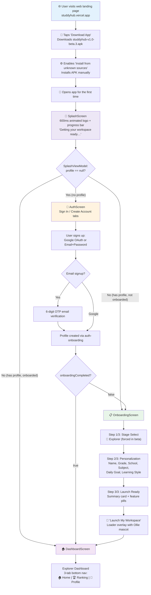
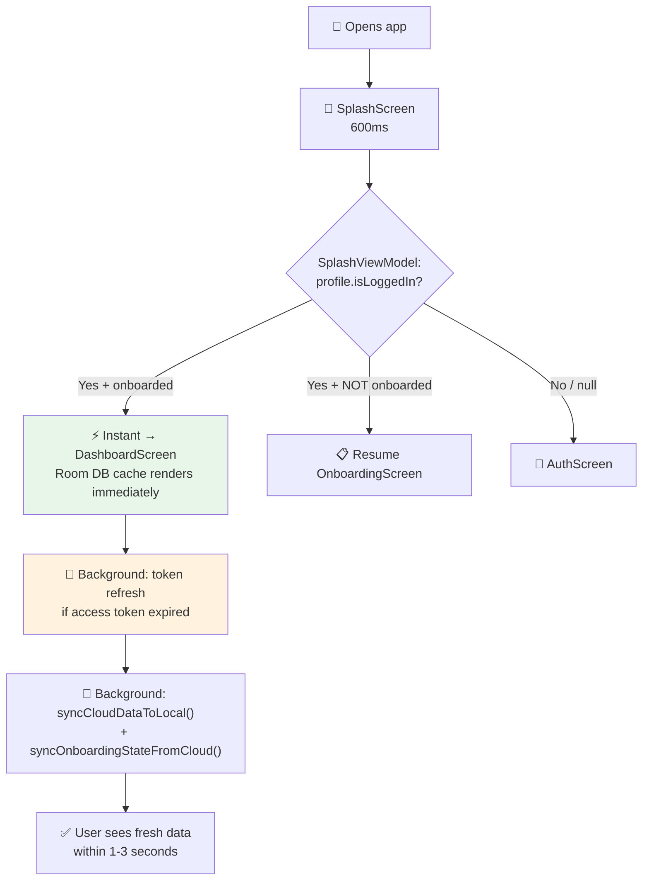
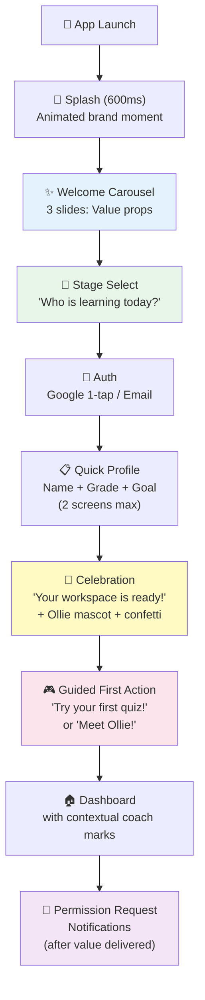

# StuddyHub Mobile App — User Flow Analysis & Production Recommendations

> **Scope:** First-time user flow, returning user flow, Explorer tier (beta testing), and production-grade UX suggestions for maximum retention.

---

## Part 1: Current Flow — First-Time User (Explorer Beta)

This is the exact code-traced journey from APK install to first interaction.



### Step-by-Step Trace

| # | Screen | What Happens | Code Source |
|---|--------|-------------|-------------|
| 1 | **Web Landing** | User discovers app via web. Android detection shows "Download App" button. Non-Android gets "Not available yet" message. | `web/` — Header.tsx, LayoutComponents.tsx |
| 2 | **APK Install** | Manual sideload. User must enable "Install from unknown sources". No Play Store. | `/studdyhub-v1.0-beta.3.apk` in `web/public/` |
| 3 | **App Launch** | `MainActivity.onCreate()` → `enableEdgeToEdge()` → `setContent { StuddyHubApp() }` | [MainActivity.kt](file:///c:/Users/USER/Desktop/studdyhub/studdyhub_repo/mobile/app/src/main/java/com/example/MainActivity.kt) |
| 4 | **Splash** | `startDestination = Screen.Splash.route`. 600ms min floor, animated logo spring bounce, indigo→dark gradient, emerald progress bar. `SplashViewModel` queries Room DB for profile. | [SplashScreen.kt](file:///c:/Users/USER/Desktop/studdyhub/studdyhub_repo/mobile/app/src/main/java/com/example/ui/screens/splash/SplashScreen.kt), [SplashViewModel.kt](file:///c:/Users/USER/Desktop/studdyhub/studdyhub_repo/mobile/app/src/main/java/com/example/ui/screens/splash/SplashViewModel.kt) |
| 5 | **Auth** | Tabbed UI: "Sign In" / "Create Account". Header banner with mascot image. Google OAuth button + email/password form. Sign-up includes full name + DOB. OTP 6-digit verification for email users. | [AuthScreen.kt](file:///c:/Users/USER/Desktop/studdyhub/studdyhub_repo/mobile/app/src/main/java/com/example/ui/screens/auth/AuthScreen.kt) |
| 6 | **Onboarding** | 3-step flow with progress bar. Skip button available. "Have an account? Sign in" link at bottom. | [OnboardingScreen.kt](file:///c:/Users/USER/Desktop/studdyhub/studdyhub_repo/mobile/app/src/main/java/com/example/ui/screens/onboarding/OnboardingScreen.kt) |
| 6a | Step 1 | **Stage Select** — In beta, only Explorer card shown (Achiever/Scholar hidden by `BETA_MODE`). Ollie mascot greets user. | OnboardingScreen L434–L519 |
| 6b | Step 2 | **Personalization** — Name, Grade (Primary 1–6, JHS 1–3), School (optional), Favourite Subject, Daily Goal (15/30/45 min, 1hr), Learning Style (Visual/Quiz/Audio/Summary). | OnboardingScreen L597–L783 |
| 6c | Step 3 | **Launch Ready** — Summary card showing selections. Feature highlight pills (AI Notes, Quiz Engine, Flashcards). "Launch My Workspace" button. | OnboardingScreen L786–L877 |
| 7 | **Workspace Setup** | Full-screen loader overlay with Ollie celebrating. Saves profile to Room → pushes to cloud. Auto-sets Ghana curriculum (NaCCA) for Explorer tier. Bootstraps kid roadmap. | [OnboardingViewModel.kt](file:///c:/Users/USER/Desktop/studdyhub/studdyhub_repo/mobile/app/src/main/java/com/example/ui/screens/onboarding/OnboardingViewModel.kt) L807–L873 |
| 8 | **Dashboard** | Explorer home with: streak calendar, next mission card, 4 hub doors (Lessons, Multiplayer, Badges, Store), arcade games carousel, daily quest vault. Bottom nav: Home / Ranking / Profile. | [DashboardScreen.kt](file:///c:/Users/USER/Desktop/studdyhub/studdyhub_repo/mobile/app/src/main/java/com/example/ui/screens/dashboard/DashboardScreen.kt) |

### Time to First Value (TTFV)

| Segment | Est. Duration |
|---------|--------------|
| Web page → download start | ~3s |
| APK download (68.5 MB) | ~15–60s (depending on connection) |
| Enable unknown sources + install | ~15–30s |
| Splash screen | 600ms |
| Auth (Google 1-tap) | ~5–8s |
| Auth (email signup + OTP) | ~30–90s |
| Onboarding (3 steps) | ~45–90s |
| Workspace setup loader | ~2–5s |
| **Total (Google path)** | **~1.5–3 min** |
| **Total (email path)** | **~2.5–5 min** |

---

## Part 2: Current Flow — Returning User



### Step-by-Step Trace

| # | What Happens | Code Source |
|---|-------------|-------------|
| 1 | `SplashScreen` displays for 600ms while Room DB is queried | [SplashViewModel.kt](file:///c:/Users/USER/Desktop/studdyhub/studdyhub_repo/mobile/app/src/main/java/com/example/ui/screens/splash/SplashViewModel.kt) L29–L43 |
| 2 | Session credentials restored from Room profile (`accessToken`, `refreshToken`, `tokenExpiresAt`) into `BackendApiService` statics | SplashViewModel L50–L53 |
| 3 | Navigation fires **immediately** (zero network blocking) based on `onboardingCompleted` flag | SplashViewModel L57–L62 |
| 4 | Background async: silent token refresh if expired → `persistSessionTokens()` | SplashViewModel L68–L83 |
| 5 | Background async: `syncCloudDataToLocal()` + `syncOnboardingStateFromCloud()` | SplashViewModel L85–L95 |
| 6 | Tier theme pre-loaded from SharedPreferences (`academic_tier`) — correct colors on first frame | [StuddyHubApp.kt](file:///c:/Users/USER/Desktop/studdyhub/studdyhub_repo/mobile/app/src/main/java/com/example/ui/StuddyHubApp.kt) L114–L122 |

### Time to Content

| Segment | Duration |
|---------|----------|
| Splash animation | 600ms |
| Room DB query | ~50–100ms |
| Dashboard render (cached) | Instant |
| Background sync completes | ~1–3s |
| **Total to interactive UI** | **~700ms** |

> [!TIP]
> The returning user flow is already well-optimized: offline-first Room cache, zero network blocking, pre-cached theme, background sync. This is solid production-grade behavior.

---

## Part 3: Findings — Gaps & Issues

### 🟢 What's Working Well

| Area | Assessment |
|------|-----------|
| **Splash → route decision** | Clean 3-way branch (auth/onboarding/dashboard) based on Room profile. Zero network blocking. |
| **Returning user speed** | <1s to interactive. SharedPreferences tier cache avoids theme flash. |
| **Onboarding structure** | 3-step progressive disclosure. Stage-aware (Explorer hides university fields). Skip + back navigation. |
| **Workspace setup loader** | Branded Ollie mascot overlay with progress. Emotional closure before dashboard. |
| **Offline resilience** | Room-first with background sync. Session tokens persisted. SyncManager queue for mutations. |
| **Tier-adaptive bottom nav** | Explorer: 3 tabs (Home/Ranking/Profile). Achiever: 4 tabs. Scholar: 5 tabs. Age-appropriate complexity. |
| **Child safety** | Parental gate, COPPA compliance, content filtering, restricted social features for Explorer. |

### 🔴 Critical Gaps

| # | Gap | Impact | Where |
|---|-----|--------|-------|
| 1 | **No value proposition before auth** | User hits "Sign In / Create Account" with zero context on what the app does. No feature showcase, no social proof, no "why". | AuthScreen is the first thing after splash for new users |
| 2 | **APK sideload friction** | "Enable unknown sources" is a trust barrier. No Play Store badge. No progress/status during install. | Web install path |
| 3 | **Onboarding can be fully skipped** | Skip button on step 1 calls `completeOnboarding()` with defaults. User lands on dashboard with no personalization. No re-prompt. | OnboardingScreen L128–L139 |
| 4 | **No feature tour / guided first action** | After onboarding, user lands on a dense dashboard with no pointer to what to do first. | Dashboard has no coach marks or first-run hints |
| 5 | **No notification/permission request flow** | No structured moment to request push notification permission. Lost re-engagement channel. | Nowhere in the flow |
| 6 | **No "What's New" for returning users** | When beta updates push, returning users see no changelog or new feature highlight. | SplashViewModel has no version check |
| 7 | **Email verification not gated** | Email users can use the app without verifying. Stale/fake emails pollute the user base. | AuthScreen allows post-OTP bypass |
| 8 | **No session expired UI** | If refresh token fails, user is silently bounced to AuthScreen with no explanation. | SplashViewModel L45–L47 |
| 9 | **Onboarding chat path is complex** | The `OnboardingViewModel` has 2 parallel paths: AI chat conversation AND manual form. The form mode was what shipped in the OnboardingScreen. The chat mode exists in the VM but the screen uses the form. This dual-track creates maintenance burden. | OnboardingViewModel has both paths |
| 10 | **No re-engagement hooks** | No streak-loss notification, no daily reminder, no "come back" nudge for inactive users. | Push notifications not implemented |

### 🟡 Minor Issues

| # | Issue | Impact |
|---|-------|--------|
| 1 | AI Podcast route shows "Coming Soon" placeholder | Feature advertised in onboarding but not functional |
| 2 | `has_completed_onboarding` SharedPreferences key exists but is redundant with Room's `onboardingCompleted` | Dead code / potential confusion |
| 3 | Explorer curriculum is hardcoded in `KidsCurriculum.kt` | Can't update content without app update |
| 4 | No analytics/crash reporting SDK | Can't measure funnel drop-off or crash rates in beta |

---

## Part 4: Production-Grade Flow Recommendations

Based on how top-tier education and consumer apps (Duolingo, Notion, Headspace, Kahoot, Khan Academy) handle onboarding for maximum retention:

### Recommended First-Time User Flow



### Detailed Recommendations

#### 1. Pre-Auth Value Carousel (NEW — Critical for Retention)

> [!IMPORTANT]
> This is the single highest-impact change. Users who understand the value before creating an account have **2–3× higher Day-7 retention** (industry benchmarks from Duolingo's Growth team).

**What to build:**
- 3–4 swipable slides shown BEFORE auth, AFTER splash
- Each slide: full-bleed illustration + headline + 1-line description
- Slide examples:
  1. "Study smarter, not harder" — AI tutor Ollie helps you learn faster
  2. "Quizzes, games & flashcards" — Turn any lesson into fun practice
  3. "Track your streak 🔥" — Build daily habits and earn badges
  4. "Compete with friends" — Leaderboards and multiplayer battles
- "Get Started" CTA button on last slide → routes to Stage Select
- Auto-advance timer (optional), manual swipe, dots indicator
- Only shown once (flag in SharedPreferences: `has_seen_welcome = true`)

**Why it matters for your beta:**
- Beta testers who don't understand the app's value will churn before exploring features
- The install path is already high-friction (APK sideload) — you need to justify the effort immediately

---

#### 2. Move Stage Select BEFORE Auth

**Current:** Auth → Onboarding (Stage Select is step 1 of onboarding)
**Recommended:** Value Carousel → Stage Select → Auth → Quick Profile → Dashboard

**Why:**
- Choosing "Explorer 🎒" feels like a personal decision, not a form field. It creates investment before the auth wall.
- The stage determines the *entire app personality* (theme, AI persona, navigation). Showing this BEFORE asking for credentials makes the app feel personalized from the start.
- Duolingo does this: you pick your language and do a lesson BEFORE creating an account.

**Implementation:** Move `StageSelectStep` to its own pre-auth screen. Pass the selected tier as a nav argument to AuthScreen, which passes it through to onboarding.

---

#### 3. Streamline Onboarding to 2 Screens Max

**Current:** 3 steps (Stage → Customization → Summary)
**Recommended:** 2 steps (Quick Profile → Celebration + First Action)

**Why:**
- Every additional onboarding step loses ~10–15% of users (Appcues benchmark)
- The "Launch Ready" summary screen (step 3) adds zero value — it just repeats what the user entered
- Move the summary to the dashboard itself (a "Welcome Card" that shows their choices)

**Quick Profile screen should collect only:**
1. Name ("What should Ollie call you?")
2. Grade (chip selector, Explorer only)
3. Daily goal (3 chip options: 15 min / 30 min / 1 hr)

**Remove from onboarding (defer to settings):**
- School name (optional, friction)
- Learning style (the app should detect this from usage patterns)
- Favourite subject (not actionable in onboarding)

---

#### 4. Guided First Action (Critical "Aha Moment")

> [!IMPORTANT]
> The "aha moment" is when a user first experiences the core value of the product. For StuddyHub Explorer, this should happen within 60 seconds of landing on the dashboard.

**What to build:**
- After onboarding completes and dashboard loads, show a **spotlight/modal** with Ollie saying:
  - *"Whoo-t! Let's try something fun! 🎮"*
  - Two CTAs: "Start a Quiz" / "Chat with Ollie"
- Tapping either takes the user directly into the experience
- This replaces the current empty-state dashboard that a new user sees

**Why:**
- Users who complete one meaningful action on Day 0 have **3.5× higher D30 retention** (Mixpanel benchmarks)
- The Explorer dashboard is feature-rich but overwhelming for a first visit. A guided first action removes choice paralysis.

---

#### 5. Contextual Coach Marks on First Dashboard Visit

**What to build:**
- On the first dashboard visit (after the guided first action), show pulsing dots on 3 key areas:
  1. The bottom nav "Ranking" tab — "See how you stack up! 🏆"
  2. The streak calendar — "Come back tomorrow to keep your streak! 🔥"
  3. A game card — "Try Ananse Riddles or Math Asteroid Blaster! 🚀"
- Tap each to dismiss. Track dismissal in SharedPreferences.
- Do NOT show all at once — stagger across the first 3 sessions.

---

#### 6. Smart Notification Permission Request

**When:** After the user completes their first quiz or game (value delivered first)

**How:**
- Ollie modal: *"Nice work! Want me to remind you when it's study time? 🕐"*
- Two buttons: "Yes, remind me" / "Maybe later"
- If "Yes" → trigger Android runtime notification permission
- If "Maybe later" → re-ask after 3rd session

**Why:**
- Asking for notifications before value is delivered → 40% lower opt-in rate
- Asking after a positive experience → 60%+ opt-in rate (OneSignal benchmarks)

---

#### 7. Streak Loss Prevention & Re-engagement

**What to build (when push notifications are implemented):**

| Trigger | Notification | Timing |
|---------|-------------|--------|
| Streak at risk | "Your 5-day streak ends at midnight! 🔥 Quick 2-min quiz?" | 6 PM on the last day |
| Streak broken | "You lost your streak 😢 Start a new one today!" | Next morning, 8 AM |
| Inactive 3 days | "Ollie misses you! 🦉 Your daily quest is waiting." | Day 3, 10 AM |
| Inactive 7 days | "3 new quizzes added! Come back and try them." | Day 7, 2 PM |
| Weekly progress | "You studied 45 min this week! Can you beat it? 📈" | Sunday, 5 PM |

---

#### 8. "What's New" Bottom Sheet for Returning Users

**When:** On first launch after an app update (compare `BuildConfig.VERSION_CODE` with stored value)

**What to show:**
- Bottom sheet with release highlights
- 2–3 bullet points with emoji
- "Got it" dismiss button
- Optional "Learn more" deep link

---

#### 9. Session Expired Graceful UI

**Current:** Silent redirect to AuthScreen
**Recommended:**
- Show a branded dialog: "Your session has expired. Please sign in again to continue."
- Pre-fill the email field from cached profile
- Google users should see "Sign in with Google" prominently

---

#### 10. Install Path Improvements for Beta

| Current | Recommended |
|---------|-------------|
| Raw APK download link | Branded download page with: app screenshots, feature bullets, install instructions with screenshots, "Step 1 / Step 2 / Step 3" visual guide |
| No install progress | "Downloading… Installing… Done! Open StuddyHub" progress UI (web-side) |
| "Enable unknown sources" with no guidance | Inline expandable instructions per Android version (Settings path differs by manufacturer) |
| No QR code | QR code on web desktop view for easy mobile access |
| No trust signals | Add: "Verified by Firebase App Distribution", download count, rating |

---

## Part 5: Priority Matrix

| Priority | Change | Impact | Effort |
|----------|--------|--------|--------|
| 🔴 P0 | Pre-auth value carousel (3 slides) | Very High — sets context before auth wall | Medium (new screen) |
| 🔴 P0 | Guided first action after onboarding | Very High — drives "aha moment" | Low (modal + CTA) |
| 🟠 P1 | Reduce onboarding to 2 screens | High — reduces drop-off | Low (remove step 3, simplify step 2) |
| 🟠 P1 | Coach marks on first dashboard visit | High — reduces overwhelm | Medium (tooltip system) |
| 🟡 P2 | Notification permission flow | Medium — enables re-engagement | Low (modal + runtime permission) |
| 🟡 P2 | Session expired dialog | Medium — prevents confused users | Low (dialog) |
| 🟡 P2 | "What's New" bottom sheet | Medium — communicates updates | Low (version check + sheet) |
| ⚪ P3 | Streak notifications | High (when notifs exist) — retention driver | Medium (backend + push) |
| ⚪ P3 | Install page redesign | Medium — reduces sideload friction | Medium (web changes) |
| ⚪ P3 | Analytics SDK integration | High — enables data-driven iteration | Medium (SDK setup) |

---

## Part 6: Recommended Flow Sequence (Final Architecture)

### First-Time User
```
Splash (600ms) → Welcome Carousel (3 slides, skippable)
→ Stage Select ("Who is learning today?")
→ Auth (Google 1-tap / Email)
→ Quick Profile (Name + Grade + Goal — 1 screen)
→ Celebration + Workspace Setup ("Ollie is building your workspace!")
→ Guided First Action ("Try your first quiz!")
→ Dashboard (with staggered coach marks over first 3 sessions)
→ Notification Permission (after first completed quiz/game)
```

### Returning User
```
Splash (600ms) → Dashboard (instant from Room cache)
→ [If app updated] "What's New" bottom sheet
→ [If session expired] Graceful re-auth dialog
→ Background: token refresh + cloud sync
```

### Returning User After Inactivity
```
Splash (600ms) → Dashboard
→ "Welcome back!" Ollie banner with streak status
→ Quick re-engagement CTA: "Pick up where you left off" / "Try something new"
```

> [!NOTE]
> These recommendations are tailored to the Explorer tier beta testing phase. When Achiever and Scholar tiers launch, the same architecture applies — only the content of the value carousel and guided first action changes per tier.
